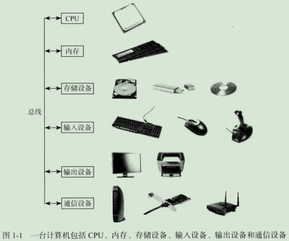
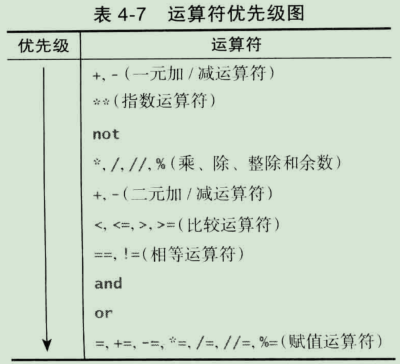
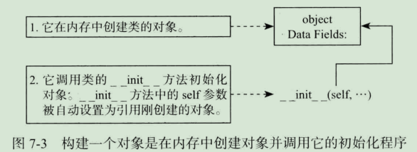
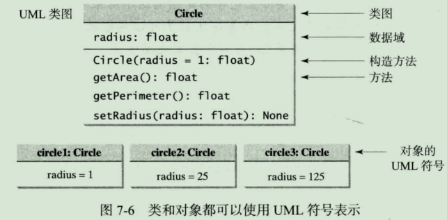
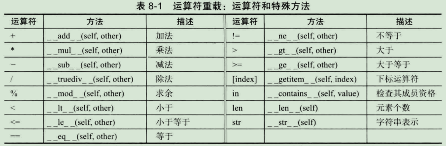

# 第一部分 程序设计基础

## 第1章 计算机 , 程序和Python概述

#### 1.2 什么是计算机

**关键点:** 计算机是存储和处理数据的电子设备.

**计算机组成:** 

- **软件**

- **硬件**:  CPU, 内存, 存储设备, 输入设备, 输出设备, 通信设备

  

  

**CPU(中央处理器)**

- 控制单元( CU ): 用来控制和协调除CPU之外其他组件的动作.
- 算术逻辑单元( ALU ): 用来完成数值运算(加法, 减法, 乘法, 除法) 以及逻辑运算(比较).

**内存**

- 内存单位: (最小存储单元)字节

#### 1.3 程序设计语言

**关键点: ** 计算机程序, 又称为软件, 是告诉计算机要做什么的指令集.

**机器语言: ** 一套内嵌在计算机内的原始指令集.

**汇编语言: ** 使用一种简短的描述性单词(称为助记符)来表示每个机器语言指令.

**高级语言: ** 独立于平台.

 - 解释器
 - 编译器

#### 1.4 操作系统

**关键点:**	操作系统(OS)是计算机上运行的最重要的程序,操作系统管理和控制计算机的动作.

**操作系统的主要任务**

 - 控制和管理系统行为
- 调配和分配系统资源
- 调度操作

#### 1.5 Python的历史

**关键点:**	Python 是一种用途广泛 , 解释性, 面向对象的程序设计语言.

#### 1.6 开始学习Python

**关键点:**	Python 程序使用Python解释器执行的.

| 字符     | 名称           | 描述                         |
| -------- | -------------- | ---------------------------- |
| ( )      | 左括号和右括号 | 和函数一起使用               |
| #        | # 号           | 表示注释行                   |
| " "      | 双引号         | 将字符串 (即字符序列) 括起来 |
| '''  ''' | 段注释         | 将一段注释括起来             |

#### 1.7 程序设计风格和文档

**关键点:**	好的程序设计风格和正确的文档可以让程序易读并防止出错.

**规范**

 - 恰当的注释和注释风格
- 恰当的空格

#### 1.8 程序设计错误

**关键点:**	程序设计错误可以分为三类: 语法错误, 运行时错误和逻辑错误.

---

## 第 2 章 基本程序设计

#### 2.1 标识符

**关键点:**	标识符用于命名程序中标识像变量和函数这样的元素.

**规则:**

 - 标识符是由字母, 数字和下划线(_)构成的字符序列

- 标识符必须以字母或下划线(_)开头, 不能以数字开头

- 标识符不能是关键字

- 标识符可以是任意长度 

**注意点:**  标识符区分大小写

  #### 2.2 变量, 赋值语句和赋值表达式

**关键点:**	变量用于引用在程序中可能会变化的值.

**注意点:**	变量在表达式中使用之前必须别赋值.

#### 2.3 定名常量

**关键点:**	定名常量是一种表示定值的标识符.

**使用常量的好处:**	

- 你不必为使用一个值多次而重复性输入
- 如果你需要修改常量的值,你只需要在源代码一处进行修改
- 描述性名字会提高程序的易读性

#### 2.4 数值数据类型和运算符

**关键点:** Python中有两中数值类型(整数和浮点数)与 + , -, *,/, //, %和** 一起工作.

#### 2.5 计算表达式和运算符优先级

**关键点:**	Python表达式计算方式与算术表达式一样.

#### 2.6 增强型赋值运算符

**关键点:**	运算符 +, -, *, /, //, %, 和 **, 可以与赋值运算符 (=) 组合在一起构成简捷运算符.

**注意点**:	在增强型赋值运算符中没有空格.

#### 2.7 类型转换和四舍五入

**关键点:**	如果算术运算符的操作数之一是浮点数那么结果就是浮点数.

#### 2.8 软件开发流程

- 需求分析
- 系统分析
- 系统设计
- 实现过程
- 测试过程

---

## 第 3 章 数学函数, 字符串和对象

#### 3.1 简单的 Python 内置函数

| 函数            | 描述                                                         |
| --------------- | ------------------------------------------------------------ |
| abs(x)          | 返回 x 的绝对值                                              |
| max(x1, x2,...) | 返回x1, x2, ...的最大值                                      |
| min(x1, x2,...) | 返回x1, x2, ...的最小值                                      |
| pow(a, b)       | 返回a^b的值, 类似a ** b                                      |
| round(x)        | 返回与x最接近的整数,如果x与两个整数接近程度相同,则返回偶数值 |
| round(x,n)      | 保留小数点后n位小数的浮点值   (对精度有要求,尽量不要使用该函数) |

#### 3.2 数学函数

| 函数         | 描述                                 |
| ------------ | ------------------------------------ |
| fabs(x)      | 将x看作一个浮点数, 返回它的绝对值    |
| ceil(x)      | x 向上取最近的整数, 然后返回这个整数 |
| floor(x)     | x 向下取最近的整数, 然后返回这个整数 |
| exp(x)       | 返回幂函数e^x的值                    |
| log(x)       | 返回 x 的自然对数值                  |
| log(x, base) | 返回以某个特殊值为底的 x 的对数值    |
| sqrt(x)      | 返回 x 的平方根植                    |
| sin(x)       | 返回 x 的正弦值, x 是角度的弧度值    |
| asin(x)      | 返回asin的弧度值                     |
| cos(x)       | 返回 x 的余弦值, x 是角度的弧度值    |
| acox(x) |返回 acox 的弧度值|
| tan(x) |返回 tan(x) 的值, x是角度的弧度值|
| degrees(x) |将 x 从弧度转换成角度|
| radians(x) |将 x 从角度转换为弧度|

#### 3.3 字符串和字符

**关键点:** 	字符串是一连串的字符. Python处理字符和字符串的方式是一样的.

**ASCII码:**	 ASCII 码使用0到127来表示字符.

**函数 ord 和 chr**

 - **ord:** ord(ch) 函数来返回字符ch的ASCII码.
- **chr:**  chr(code) 函数返回code 所代表的字符.

**函数str:** str函数可以将一个数字转换成一个字符串.

**字符串连接操作 (+) **

**从控制台读取字符串input()函数**

#### 3.4 实例研究：最小数量的硬币

**注意点：**浮点数转整型可能会损失精度。

#### 3.5 对象和方法简介

**关键点：**在Python中，所有的数据（包括数字和字符串）实际都是对象。

**Python中的变量实际上是一个对象的引用。**

#### 3.6 格式化数字和字符串

**关键点：** 使用format函数返回格式化的字符串。

**format函数语法：**

**format(item, format-specifier)**

  - **item：** 数字或者字符串
- **format-specifier格式说明符：**指定条目item的格式
- 此函数返回一个字符串

**常用的说明符**

| 说明符   | 格式                                                 |
| -------- | ---------------------------------------------------- |
| ”10.2f“  | 格式化浮点数，宽度为 10 精度为 2                     |
| ”10.2e"  | 格式化浮点数（以科学记数法表示），宽度为 10 精度为 2 |
| “5d”     | 将整数格式化为宽度为 5 的十进制数                    |
| “5x”     | 将整数格式化为宽度为 5 的十六进制数                  |
| “5o”     | 将整数格式化为宽度为 5 的八进制数                    |
| “5b"     | 将整数格式化为宽度为 5 的二进制数                    |
| ”10.2%“  | 将数格式化为百分数                                   |
| ”50s“    | 将字符串格式化为宽度为 50 的字符串                   |
| ”<10.2f" | 向左对齐格式化项目                                   |
| “>10.2f” | 向右对齐格式化项目                                   |

---

## 第 4 章 选择

#### 4.1 引言

**关键点：**程序可以根据某个条件决定执行哪条语句。

**选择语句使用的条件称为布尔表达式**

#### 4.2 布尔类型、数值和表达式

**关键点：** 布尔表达式是能计算出一个布尔值 True 或 False 的表达式。

**比较运算符：** **< , <=, > >=, ==,!=** 比较的结果就是一个布尔逻辑值。

#### 4.3 产生随机数字

**关键点：** 函数randint(a, b)可以用来产生一个a和b之间且包括a和b的随机整数。

#### 4.4 if语句

**关键点：**如果条件正确就执行一个单向if语句。

#### 4.6 双向 if-else 语句

**关键点：**双向 if-else语句根据条件是真还是假来决定执行哪些语句。

#### 4.8 选择语句中的常见错误

**关键点：**选择语句中的大多数常见错误都是由不正确的缩进问题导致的。

#### 4.11 逻辑运算符

**关键点：**逻辑运算符not、and 和 or都可以用来创建一个组合条件。

**4.14 条件表达式**

**关键点：** 条件表达式是根据某个条件计算一个表达式。

**句法结构：**

expression1	 if    boolean-expression	else  expression2

**说明：**

布尔逻辑表达式为真，条件表达式的结果就是expression1， 否则这个结果就是 expression2

#### 4.15 运算符的优先级和结合方向

**关键点：** 运算符的优先级和结合方向决定了运算符的计算顺序。



---

## 第 5 章 循环

#### 5.1 引言

**关键点：**可以使用循环来告诉程序重复执行某些语句。

#### 5.2 while 循环

**关键点：** 当一个条件保持为真时 while 循环重复执行语句。

**while 循环的语法**

```python
while loop-continuation-condition:
    # Loop body
    Statement(s)
```

**警告：**在循环控制里不要使用浮点值来比较相等。因为这些值都是近似的，所以它们会导致不精确的计算值。

**输入重定向:(命令行)**

python sentinelvalue.py < input.txt

**输出重定向:(命令行)**

python sentinelvalue.py > output.txt

#### 5.3 for循环

**关键点：**Python 的 for 循环通过一个序列中的每个值来进行迭代。

---

## 第 6 章 函数

#### 6.1 引言

**关键点：**函数可以用来定义可重用代码、组织和简化代码。

#### 6.2 定义一个函数

**关键点：**函数定义包括函数名称、形参以及函数体。

**定义函数的语法**

```python
def functionName(list of parameters):
	# Function body
```

**函数**

- 函数头：以一个 def 关键字开始，后面紧接着函数名以及形参（可选）并以冒号结束。函数头中的参数被称为形式参数或简称为形参。参数就像一个占位符：当调用函数时，就将一个值传递给参数。
- 函数体

#### 6.3 调用一个函数

**关键点：** 调用一个函数来执行函数中的代码。

**程序控制权：**当程序调用一个函数时，程序控制权就会转移到被调用的函数上。当执行完函数的返回语句或执行到函数结束时，被调用函数就会将程序控制权交还给调用者。

**调用栈：**每次调用一个函数时，系统就会创建一个为函数存储它的参数和变量的激活记录，然后将这个激活记录放在一个被称为堆栈的内存区域。

#### 6.4 带返回值或不带返回值的函数

**关键点：**函数不是一定有返回值。

#### 6.5 位置参数和关键字参数

**关键点：**函数实参是作为位置参数和关键字参数被传递。

**注意：**位置参数不能出现在任何关键字参数之后。

#### 6.6 通过传引用来传递参数

**关键点：**当你调用带参数的函数时，每个实参的引用值被传递给函数的形参。

#### 6.7 模块化代码

**关键点：**模块化可以使代码易于维护和调试，并且提高代码的重用性。

#### 6.9 变量的作用域

**关键点：**变量的作用域是指该变量可以在程序中被引用的范围。

**注意点：**函数体内的变量和全局变量同名时，则全局变量不能在该函数体内访问。

#### 6.10 默认参数

**关键点：**Python 允许定义带有默认参数值的函数。当函数被调用时无参数，那么这些默认值就会被传递给实参。

**注意：**函数可以混用默认值参数和非默认值参数。这种情况下，非默认值参数必须定义在默认值参数之前。

**注意：**Python不支持在同一个模块里定义两个同名函数。

#### 6.11 返回多个值

**关键点：**Python 的 return 语句可以返回多个值。

#### 6.13 函数抽象和逐步求精

**关键点：**函数抽象就是将函数的使用和函数的实现分开来实现的。

---

# 第二部分 面向对象程序设计

## 第 7 章 对象和类

#### 7.1 引言

**关键点：**面向对象程序设计可以让你高效地开发大型软件和图形用户界面。

#### 7.2 为对象定义类

**关键点：**类定义对象的特征和行为。

**定义一个类的语法**

```python
class ClassName:
    initializer
    methods
```

**构造方法**

- 在内存中为类创建一个对象。
- 调用类的 __init__ 方法来初始化对象。

**对象是如何被创建并初始化**



**访问对象成员**

- 数据域（实例变量）
- 方法（实例方法）

**对象访问运算符：**圆点运算符（.）

**匿名对象：**创建对象并调用实例方法。

**self参数**

- self 是指向对象本身的参数。
- 一旦一个实例变量被创建，那么它的作用域就是整个类。

#### 7.3 UML类图

**关键点：**UML 类图表示用图形符号描述类。

**UML类图**

- **数据域：** dataFieldName : dataFieldType

- **构造方法：**Class Name(parameterName: parameterType)

- **方法：**methodName(parameterName: parameterType) : returnType

  

#### 7.4 不变对象和可变对象

**关键点：**当将一个可变对象传给函数时，函数可能会改变这个对象的内容。

#### 7.5 隐藏数据域

**关键点：**使数据域私有来保护数据，让类更易于维护。

**提示：**如果类是被设计来给其他程序使用的，为了防止数据被篡改并使类易于维护，就将数据域定义为私有的。如果这个类只是在程序内部使用，那就没必要隐藏数据域。

**注意：**使用两个下划线开头来命名私有数据域和方法，但不要以一个以上的下划线结尾。以两个下划线开头同时以两个下划线结尾的名字具有特殊的含义。

#### 7.6 类的抽象与封装

**关键点：**类的抽象是将类的实现和类的使用分离的概念。类的实现的细节对用户而言是不可见的。这就是类的封装。

#### 7.7 面向对象的思考

**关键点：**面向过程范型程序设计的重点在设计函数上。而面向对象范型将数据和方法一起合并到对象中。使用面向对象范型的软件设计的重点是在对象和对象上的操作。

---

## 第 8 章 更多字符串和特殊方法

#### 8.1 引言

**关键点：**本章将重点放在类的设计上，它使用Python中的str类为例并探索Python中特殊方法的作用。

#### 8.2 str类

**关键点：**一个 str 对象是不可变的；这也就是说，一旦创建了这个字符串，那么它的内容是不可变的。

**创建字符串：**

- 构造函数 str()
- 字面量

**处理字符串的函数：**

- max()：返回字符串中的最大字符
- min()： 返回字符串中的最小字符
- len()：返回字符串中的字符个数

**下标运算符[]**

**截取运算符[start: end]**

**注意：**如果截取操作 s[i:j] 中的下标（i或j）是负数，那么就用len(s)+index 来替换下标。如果j>len(s)，那么 j 就会被设置成len(s) 。如果 i >= j，那么截取的子串就会成为空串。

**连接运算符 + 和复制运算符***

**in 和 not in 运算符：**使用 in 和 not in操作来测试一个字符串是否在另一个字符串中。

**比较字符串：**使用比较运算符来对字符串进行比较。

**迭代字符串：**字符串是可迭代的。

**测试字符串：**

| 方法名         | 返回值类型 | 说明                 |
| -------------- | ---------- | -------------------- |
| isalnum()      | bool       | 是否是字母数字字符串 |
| isalpha()      | bool       | 是否是字母字符串     |
| isdigit()      | bool       | 是否是数字字符串     |
| isidentifier() | bool       | 是否是Python标识符   |
| islower()      | bool       | 是否全小写           |
| isupper()      | bool       | 是否全大写           |
| isspace()      | bool       | 是否只包含空格       |

**搜索子串**

| 方法名               | 返回值类型 | 说明                                                         |
| -------------------- | ---------- | ------------------------------------------------------------ |
| endswith(s1: str)    | bool       | 如果字符串以子串s1结尾则返回True                             |
| startswith(s1:  str) | bool       | 如果字符串是以子串s1开始则返回True                           |
| find(s1)             | int        | 返回s1在这个字符串的最低下标，如果字符串中不存在s1，则返回 -1 |
| rfind(s1)            | int        | 返回s1在这个字符串的最高下标，如果字符串中不存在s1，则返回-1 |
| count(substring)     | int        | 返回这个子串在字符串中出现的无覆盖的次数                     |

**转换字符串**

| 方法名            | 返回值类型 | 说明                                                         |
| ----------------- | ---------- | ------------------------------------------------------------ |
| capitalize()      | str        | 返回这个复制的字符串并只大写第一个字符                       |
| lower()           | str        | 返回这个复制的字符串并将所有字母转换为小写的                 |
| upper()           | str        | 返回这个复制的字符串并将所有字母转换为大写的                 |
| title()           | str        | 返回这个复制的字符串并大写每个单词的首字母                   |
| swapcase()        | str        | 返回这个复制的字符串，将小写字母转换成大写，将大写字母转换成小写 |
| replace(old, new) | str        | 返回一个新的字符串，它用一个新字符串替换旧字符串所有出现的地方 |

**删除字符串中的空格**

字符 ‘ ’、\t、\f、\r、\n 都被称作空白字符。

| 方法名   | 返回值类型 | 说明                         |
| -------- | ---------- | ---------------------------- |
| lstrip() | str        | 返回去掉前端空白字符的字符串 |
| rstrip() | str        | 返回去掉末端空白字符的字符串 |
| strip()  | str        | 返回去掉两端空白字符的字符串 |

#### 8.5 运算符重载和特殊方法

**关键点：**Python允许为运算符和函数定义特殊的方法来实现常用的操作。Python使用一种独特方式来命名这些方法以辨别它们的关联性。



---

## 第 10 章 列表

#### 10.1 引言

**关键点：**一个列表可以存储任意大小的数据集合。

#### 10.2 列表基础

**关键点：**列表是一个用 list 类定义的序列，它包括了创建、操作和处理列表的方法。列表中的元素可以通过下标来访问。

**注意点：**越界访问报运行时错误。

**列表解析：**一个列表解析由多个方括号组成，方括号内包含后跟一个for子句的表达式，之后是0或多个for或if子句。

**列表方法**

| 方法名                        | 返回值类型 | 说明                                                         |
| ----------------------------- | ---------- | ------------------------------------------------------------ |
| append(x：object)             | None       | 将元素 x 添加到列表结尾                                      |
| count(x：object)              | int        | 返回元素 x 在列表中的出现次数                                |
| extend(lst：list)             | None       | 将 lst 中的所有元素追加到列表中                              |
| index(x：object)              | int        | 返回元素 x 在列表中第一次出现的下标                          |
| insert(index：int，x：object) | None       | 将元素 x 插入列表中指定下标处。注意：列表第一个元素的下标是0 |
| pop(i)                        | object     | 删除给定位置的元素并且返回它。参数 i 是可选的。如果没有指定它，那么删除list.pop()并返回列表中的最后一个元素 |
| remove(x：object)             | None       | 删除列表中第一次出现的 x                                     |
| reverse()                     | None       | 将列表中的所有元素倒序                                       |
| sort()                        | None       | 以升序将列表中的元素排序                                     |

#### 10.7 将列表传递给函数

**关键点：**当列表被传递给函数时，由于列表是一个可变对象，所以列表的内容可能会在函数调用后改变。

#### 10.8 从函数返回一个列表

**关键点：**当函数返回一个列表时，就会返回这个列表的引用值。

#### 10.10 查找列表

**关键点：**如果一个列表是排好序的，那么要查找一个列表中的某个元素，二分查找比线性查找更高效。

---

## 第 11 章 多维列表

#### 11.1 引言

**关键点：**一张表或矩阵中的数据可以存储在一个二维列表中。

#### 11.2 处理二维列表

**关键点：**二维列表中的值可以通过行下标和列下标来访问。

#### 11.3 将二维列表传递给函数

**关键点：**当给函数传递二维列表时，是将这个列表的引用传递给函数。

#### 11.9 多维列表

**关键点：**二维列表是包含了一维列表的列表，而三维列表是包含了二维列表的列表。

---

#### 第 12 章 继承和多态

#### 12.1 引言

**关键点：**面向对象程序设计可以从现有类定义新类，这被称为继承。

#### 12.2 父类和子类

**关键点：**继承可以定义一个通用类(父类)，随后将它扩展为更多特定的类(子类)。

**注意：**在面向对象的术语中，如果类C1扩展自另一个类C2，那么就将C1称为派生类、孩子类或子类，而将C2称为超类基类、父类或超类。

#### 12.3 覆盖方法

**关键点：**为了覆盖父类的方法，子类中的方法必须使用与父类方法一样的方法头。

**注意：**私有方法不能被覆盖。

#### 12.4 object类

**关键点：**Python中的所有类都派生自object类。

#### 12.5 多态和动态绑定

**关键点：**多态是指子类的对象可以传递给需要父类类型的参数。一个方法可以沿着继承链的几个类执行。运行时由Python决定调用哪个方法，这被称为动态绑定。

#### 12.6 isinstance函数

**关键点：**isinstance函数能够用来判断一个对象是否是一个类的实例。

#### 12.8 类之间的关系

**关键点：**为了设计类，我们需要探讨不同类之间的关系。类之间的常见关系有关联、聚合和继承。

**关联**

- 含义：关联是一种常用的二元关系，可以描述两个类之间的一个动作。
- 实现：数据域和方法实现关联性。

**聚合和组合**

- 含义：聚合是关联的一种特殊形式，它反映了两个对象之间的归属关系。(数据域实现)

**注意：**因为聚合和组合关系在类中使用同样的方式实现，为了简化，我们都将它们归为组合。

---

#### 第 13 章 文件和异常处理

#### 13.1 引言

**关键点：**可以使用一个文件来永久保存数据；可以使用异常处理使编写的程序安全可靠。

#### 13.2 文本输入和输出

**关键点：**为了从文件读数据或向文件写数据，需要使用 open 函数创建一个文件对象并使用这个对象的 read 和 write 方法来读写数据。

**文件模式**

| 模式 | 描述                                                   |
| ---- | ------------------------------------------------------ |
| ”r“  | 只读读取模式打开一个文件，文件不存在报错。             |
| "w"  | 只写打开一个文件，文件不存在，新建，文件存在清空内容。 |
| "a"  | 追加模式打开一个文件                                   |
| "rb" | 以二进制模式读文件                                     |
| "wb" | 以二进制模式写文件                                     |

**读出数据**

| 方法                | 返回值类型 | 说明                                                         |
| ------------------- | ---------- | ------------------------------------------------------------ |
| read([number：int]) | str        | 从文件返回指定个数个字符。如果参数被忽略，那么读取文件中全部剩余的内容。 |
| readline()          | str        | 返回文件的一行                                               |
| readlines()         | list       | 返回文件的全部行                                             |

**测试文件的存在性**

**os.path：**模块中的isfile()函数

#### 13.6 异常处理

**异常处理代码**

```python
try:
    <body>
except <ExceptionType>:
    <handler>
```

#### 13.10 使用Pickling进行二进制IO

**关键字：**为了使用 Pickling 进行二进制IO，使用模式rb和wb打开一个文件以进行二进制读写并调用pickle模块中的dump和load函数来读写数据。

---

# 第三部分 数据结构和算法

## 第 14 章 元组、集合和字典

#### 14.1 引言

**关键点：** 可以使用元祖存储一个固定的元素列表，使用集合存储和快速访问不重复的元素，使用字典存储键值对并使用这些关键字来快速访问元素。

#### 14.2 元组

**关键点：** 元组跟列表类似，但是元组中的元素是固定的；也就是说，一旦一个元组被创建，就无法对元组中的元素进行添加、删除、替换或重新排序。

**注意：**一个元组包含了一个固定的元素列表。一个元组里的一个个体元素可能是易变的。

#### 14.3 集合

**关键点：**集合与列表类似，可以使用它们存储一个元素集合。但是，不同于列表，集合中的元素是不重复且不是按任何特定顺序放置的。

**创建集合**

空集合使用set()，{}用来创建一个空字典。

**操作和访问集合**

- add(e)
- remove(e): 如果删除一个集合中不存在的元素，remove(e) 方法将抛出一个 KeyError 异常。

**子集和超集**

s1.issubset(s2)方法来判断s1是否是s2的子集。

**相等型测试：**

== 和 !=检测两个集合是否包含相同的元素。

**集合运算**

- 并集：union方法或者|运算符
- 交集：intersection方法或者&运算符
- 差集：difference方法或者-运算符
- 异或：symmertric_difference方法或者^运算符

#### 14.4 比较集合和列表的性能

**关键点：**对于 in 和 not in 运算符和 remove 方法，集合比列表的效率更高。

#### 14.6 字典

**关键点：**一个字典是一个存储键值对集合的容器对象。它通过使用关键字实现快速获取、删除和更新值。

**删除条目：**del students["234-56-9010"]

**字典方法**

| 方法名    | 返回值类型 | 说明                                                   |
| --------- | ---------- | ------------------------------------------------------ |
| keys()    | tuple      | 返回一个关键字序列                                     |
| values()  | tuple      | 返回一个值序列                                         |
| items()   | tuple      | 返回一个元组序列，每个元组都是一个条目的（键，值）     |
| clear()   | None       | 删除所有条目                                           |
| get(key)  | value      | 返回这个关键字对应的值                                 |
| pop(key)  | value      | 删除这个关键字对应的条目并返回它的值                   |
| popitem() | tuple      | 返回一个随机选择的键值对作为元组并删除这个被选择的条目 |

---

## 第 15 章 递归

**递归和迭代**

**关键点：**递归是程序控制的一种可替代方式，它实质上就是不用循环控制的重复。

**注意：**递归的程序可能会用完内存，引起一个栈溢出错误。

**尾递归**

**关键点：**尾递归对减少堆栈大小很有效

