## 1. 起步

#### 1.6 初次运行 Git 前的配置

**1.变量存储位置**

1. `/etc/gitconfig` 文件: 包含系统上每一个用户及他们仓库的通用配置。 如果使用带有 `--system` 选项的 `git config` 时，它会从此文件读写配置变量。 
2. `~/.gitconfig` 或 `~/.config/git/config` 文件：只针对当前用户。 可以传递 `--global` 选项让 Git 读写此文件。 
3. 当前使用仓库的 Git 目录中的 `config` 文件（是 `.git/config`）：针对该仓库。 

**2.配置用户信息**

设置用户名和邮件地址

```shell
$ git config --global user.name "John Doe"
$ git config --global user.email johndoe@example.com
```

**3.配置文本编辑器**

设置指定的文本编辑器emacs

```shell
$ git config --global core.editor emacs
```

**4.检查配置信息**

使用 `git config --list` 命令来列出所有 Git 当前能找到的配置

```shell
$ git config --list
```

`git config <key>` 检查某一项配置

Git 会从不同的文件中读取同一个配置,这种情况下,Git 会使用它找到的每一个变量的最后一个配置.

#### 1.7 起步 - 获取帮助

使用 Git 时需要获取帮助, 下面的三种方法可以找到 Git 命令的使用手册:

```shell
$ git help <verb>
$ git <verb> --help
$ man git-<verb>
```

例如, 要想获得 config 命令的手册,执行

```shell
$ git help config
```

---

## 2. Git 基础

#### 2.1 Git 基础 - 获取 Git 仓库

**获取 Git 仓库的方法**

- 第一种是在现有项目或目录下导入所有文件到 Git 中.
- 第二种是从一个服务器克隆一个现有的 Git 仓库.

**在现有目录中初始化仓库**

如果你打算使用 Git 来对现有的项目进行管理,你只需要进入该项目目录并输入:

```shell
$ git init
```

该命令将创建一个名为`.git`的子目录,这个子目录含有你初始化的 Git 仓库中所有的必须文件,这是 Git仓库的骨干.

**克隆现有的仓库**

克隆仓库的命令格式是:`git clone [url]`

```shell
$ git clone https://github.com/libgit2/libgit2
```

这会在当前目录下创建一个名为 "libgit2" 的目录, 并在这个目录下初始化一个 `.git`文件夹, 从远程仓库拉取下所有数据放入`.git`文件夹,然后从中读取最新版的文件的拷贝.

#### 2.2 Git 基础 - 记录每次更新到仓库

**记录每次更新到仓库**

Git 时文件的生命周期

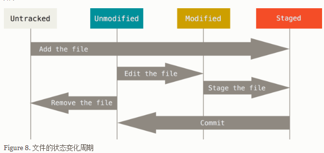

**检查当前文件状态**

要查看哪些文件处于什么状态, 可以用 `git status`命令.

```shell
$ git status
```

`git status`命令的输出十分详细,但其用语有些繁琐.

**状态简览**

使用`git status -s`命令或者 `git status --short`命令,你将得到一种更为紧凑的格式输出.

```shell
$ git status -s
 M README
MM Rakefile
A  lib/git.rb
M  lib/simplegit.rb
?? LICENSE.txt
```

`??`标记 	指新添加的未跟踪文件

`A`标记	指新添加到暂存区中的文件

`M`标记	指修改过的文件:

  - 出现在右边的 `M` 表示该文件被修改了但是还没放入暂存区，
- 出现在靠左边的 `M` 表示该文件被修改了并放入了暂存区 

**跟踪新文件**

使用命令`git add`开始跟踪一个文件.

```shell
$ git add README
```

`git add`命令使用文件或目录的路径作为参数, 如果参数是目录的路径,该命令将递归的跟踪该目录下的所有文件.

**暂存已修改文件**

修改一个已被跟踪的文件后,然后运行`git status`命令,该文件出现在`Changes not staged for commit`这行下面,说明已跟踪文件的内容发生了变化,但还没有放到暂存区.要暂存这次更新,需要运行`git add`命令.

`git add`命令用法:

- 可以用它开始跟踪新文件，
- 或者把已跟踪的文件放到暂存区，
- 还能用于合并时把有冲突的文件标记为已解决状态等 

**忽略文件**

我们总有些文件无需纳入 Git 的管理, 也不希望它们总出现在未跟踪文件列表.

在这种情况下,我们可以创建一个名为`.gitignore` 的文件,列出要忽略的文件模式.

```shell 
$ cat .gitignore
*.[oa]
*~
```

第一行告诉 Git 忽略所有以`.o`或`.a` 结尾的文件.

第二行告诉 Git 忽略所有以波浪符 (~) 结尾的文件.

文件`.gitignore`的格式规范如下:

- 所有空行或者以`#`开头的行都会被 Git 忽略.
- 可以使用标准的 glob 模式匹配.
- 匹配模式可以以 (`/`) 开头防止递归.
- 匹配模式可以以 (`/`) 结尾指定目录.
- 要忽略指定模式以外的文件或目录, 可以在模式前加上惊叹号 (`!`) 取反.

glob 模式是指shell所使用的简化了的正则表达式.

- 星号 (`*`) 匹配零个或多个任意字符.
- [`abc`] 匹配任何一个列在方括号中的字符.
- 问号 (`?`) 只匹配一个任意字符.
- 如果在方括号中使用短划线分隔两个字符，表示所有在这两个字符范围内的都可以匹配（比如 `[0-9]` 表示匹配所有 0 到 9 的数字）.
-  使用两个星号（`*`) 表示匹配任意中间目录，比如`a/**/z` 可以匹配 `a/z`, `a/b/z` 或 `a/b/c/z`等。 

**查看已暂存和未暂存的修改**

`git status`命令的输出对于你来说过于模糊, 你想知道具体修改了什么地方, 可以使用`git diff`命令.

`git diff` 命令比较的是工作目录中当前文件和暂存区域快照之间的差异, 也就是修改之后还没有暂存起来的变化内容.

查看已暂存的将要添加到下次提交里的内容,可以用`git diff --cached`命令.(或者 `git diff --staged`)

`git diff` 本身只显示尚未暂存的改动,而不是自上次提交以来所做的所有改动.

**提交更新**

每次准备提交前, 先用`git status`看下是不是都已暂存起来了, 然后再运行提交命令`git commit`

```shell
$ git commit
```

可以看到，默认的提交消息包含最后一次运行 `git status` 的输出，放在注释行里，另外开头还有一空行，供你输入提交说明。  

如果想要更详细的对修改了哪些内容的提示，可以用 `-v` 选项，这会将你所做的改变的 diff 输出放到编辑器中从而使你知道本次提交具体做了哪些修改。  退出编辑器时，Git 会丢掉注释行，用你输入提交附带信息生成一次提交。 

另外，你也可以在 `commit` 命令后添加 `-m` 选项，将提交信息与命令放在同一行，如下所示： 

```shell
$ git commit -m "Story 182: Fix benchmarks for speed"
```

请记住，提交的记录是放在暂存区域的快照。 任何还未暂存的仍然保持已修改状态，可以在下次提交时纳入版本管理。 每一次运行提交操作，都是对你项目作一次快照，以后可以回到这个状态，或者进行比较。 

**跳过使用暂存区域**

尽管使用暂存区域的方式可以精心准备要提交的细节,但有时候这么做略显繁琐. Git 提供了一个跳过使用暂存区域的方式,只要在提交的时候,给 `git commit`加上`-a`选项, Git 就会自动把所有已经跟踪过的文件暂存起来一并提交, 从而跳过`git add`步骤.

**移除文件**

要从 Git 中移除某个文件,就必须要从已跟踪文件清单中移除 (确切的说, 是从暂存区域移除), 然后提交.可以用 `git rm` 命令完成此项工作，并连带从工作目录中删除指定的文件，这样以后就不会出现在未跟踪文件清单中了 .

下一次提交时，该文件就不再纳入版本管理了。 如果删除之前修改过并且已经放到暂存区域的话，则必须要用强制删除选项 `-f`（译注：即 force 的首字母）。 这是一种安全特性，用于防止误删还没有添加到快照的数据，这样的数据不能被 Git 恢复。 

另外一种情况是，我们想把文件从 Git 仓库中删除（亦即从暂存区域移除），但仍然希望保留在当前工作目录中。 换句话说，你想让文件保留在磁盘，但是并不想让 Git 继续跟踪。 当你忘记添加 `.gitignore` 文件，不小心把一个很大的日志文件或一堆 `.a` 这样的编译生成文件添加到暂存区时，这一做法尤其有用。 为达到这一目的，使用 `--cached` 选项： 

```shell
$ git rm --cached README
```

`git rm` 命令后面可以列出文件或者目录的名字，也可以使用 `glob` 模式。 比方说： 

```shell
$ git rm log/\*.log
```

注意到星号 `*` 之前的反斜杠 `\`， 因为 Git 有它自己的文件模式扩展匹配方式，所以我们不用 shell 来帮忙展开。 此命令删除 `log/` 目录下扩展名为 `.log` 的所有文件。 

**移动文件**

Git 中对文件改名

```shell
$ git mv file_from file_to
```

其实，运行 `git mv` 就相当于运行了下面三条命令： 

```
$ mv README.md README
$ git rm README.md
$ git add README
```

#### 2.3 Git 基础 - 查看提交历史

查看提交历史使用`git log`命令

```
$ git log
commit ca82a6dff817ec66f44342007202690a93763949
Author: Scott Chacon <schacon@gee-mail.com>
Date:   Mon Mar 17 21:52:11 2008 -0700

    changed the version number

commit 085bb3bcb608e1e8451d4b2432f8ecbe6306e7e7
Author: Scott Chacon <schacon@gee-mail.com>
Date:   Sat Mar 15 16:40:33 2008 -0700

    removed unnecessary test

commit a11bef06a3f659402fe7563abf99ad00de2209e6
Author: Scott Chacon <schacon@gee-mail.com>
Date:   Sat Mar 15 10:31:28 2008 -0700

    first commit
```

默认不用任何参数的话，`git log` 会按提交时间列出所有的更新，最近的更新排在最上面。 正如你所看到的，这个命令会列出每个提交的 SHA-1 校验和、作者的名字和电子邮件地址、提交时间以及提交说明。 

`git log` 有许多选项可以帮助你搜寻你所要找的提交， 接下来我们介绍些最常用的。

一个常用的选项是 `-p`，用来显示每次提交的内容差异。

你也可以为 `git log` 附带一系列的总结性选项。 比如说，如果你想看到每次提交的简略的统计信息，你可以使用 `--stat` 选项.

另外一个常用的选项是 `--pretty`。 这个选项可以指定使用不同于默认格式的方式展示提交历史。 这个选项有一些内建的子选项供你使用。 比如用 `oneline` 将每个提交放在一行显示，查看的提交数很大时非常有用。 另外还有 `short`，`full` 和 `fuller` 可以用，展示的信息或多或少有些不同，请自己动手实践一下看看效果如何。 

```
$ git log --pretty=oneline
ca82a6dff817ec66f44342007202690a93763949 changed the version number
085bb3bcb608e1e8451d4b2432f8ecbe6306e7e7 removed unnecessary test
a11bef06a3f659402fe7563abf99ad00de2209e6 first commit
```

但最有意思的是 format，可以定制要显示的记录格式。 这样的输出对后期提取分析格外有用 — 因为你知道输出的格式不会随着 Git 的更新而发生改变： 

```
$ git log --pretty=format:"%h - %an, %ar : %s"
ca82a6d - Scott Chacon, 6 years ago : changed the version number
085bb3b - Scott Chacon, 6 years ago : removed unnecessary test
a11bef0 - Scott Chacon, 6 years ago : first commit
```

| 选项  | 说明                                        |
| ----- | ------------------------------------------- |
| `%H`  | 提交对象（commit）的完整哈希字串            |
| `%h`  | 提交对象的简短哈希字串                      |
| `%T`  | 树对象（tree）的完整哈希字串                |
| `%t`  | 树对象的简短哈希字串                        |
| `%P`  | 父对象（parent）的完整哈希字串              |
| `%p`  | 父对象的简短哈希字串                        |
| `%an` | 作者（author）的名字                        |
| `%ae` | 作者的电子邮件地址                          |
| `%ad` | 作者修订日期（可以用 --date= 选项定制格式） |
| `%ar` | 作者修订日期，按多久以前的方式显示          |
| `%cn` | 提交者（committer）的名字                   |
| `%ce` | 提交者的电子邮件地址                        |
| `%cd` | 提交日期                                    |
| `%cr` | 提交日期，按多久以前的方式显示              |
| `%s`  | 提交说明                                    |

**限制输出长度**

之前你已经看到过 `-2` 了，它只显示最近的两条提交， 实际上，这是 `-<n>` 选项的写法，其中的 `n` 可以是任何整数，表示仅显示最近的若干条提交。  

另外还有按照时间作限制的选项，比如 `--since` 和 `--until` 也很有用。 例如，下面的命令列出所有最近两周内的提交： 

```
$ git log --since=2.weeks 
```

用 `--author` 选项显示指定作者的提交，用 `--grep` 选项搜索提交说明中的关键字。 （请注意，如果要得到同时满足这两个选项搜索条件的提交，就必须用 `--all-match` 选项。否则，满足任意一个条件的提交都会被匹配出来） 

另一个非常有用的筛选选项是 `-S`，可以列出那些添加或移除了某些字符串的提交。 比如说，你想找出添加或移除了某一个特定函数的引用的提交，你可以这样使用： 

```
$ git log -Sfunction_name
```

最后一个很实用的 `git log` 选项是路径（path）， 如果只关心某些文件或者目录的历史提交，可以在 git log 选项的最后指定它们的路径。 

限制 `git log`输出的选项

| 选项                   | 说明                               |
| ---------------------- | ---------------------------------- |
| `-(n)`                 | 仅显示最近的 n 条提交              |
| `--since`  ,` --after` | 仅显示指定时间之后的提交           |
| `--until` , `--before` | 仅显示指定时间之前的提交           |
| `--author`             | 仅显示指定作者相关的提交           |
| `--commiter`           | 仅显示指定提交者相关的提交         |
| `--grep`               | 仅显示含指定关键字的提交           |
| `-S`                   | 仅显示添加或移除了某个关键字的提交 |

#### 2.4 Git 基础 - 撤销操作

**撤销操作**

有时候我们提交完了才发现漏掉了几个文件没有添加，或者提交信息写错了。 此时，可以运行带有 `--amend` 选项的提交命令尝试重新提交： 

```shell
$ git commit --amend
```

这个命令会将暂存区中的文件提交.

例如，你提交后发现忘记了暂存某些需要的修改，可以像下面这样操作： 

```shell
$ git commit -m 'initial commit'
$ git add forgotten_file
$ git commit --amend
```

最终你只会有一个提交,第二次提交将代替第一次提交的结果.

**取消暂存的文件**

```shell
$ git reset HEAD CONTRIBUTING.md
```

**撤销对文件的修改**

```shell
$ git checkout -- CONTRIBUTING.md
```

记住，在 Git 中任何已提交的东西几乎总是可以恢复的。 甚至那些被删除的分支中的提交或使用 `--amend`选项覆盖的提交也可以恢复。 然而，任何你未提交的东西丢失后很可能再也找不到了。 

#### 2.5 Git 基础 - 远程仓库的使用

**查看远程仓库**

如果想查看你已经配置的远程仓库服务器，可以运行 `git remote` 命令。会列出你指定的每一个远程服务器的简写。 如果你已经克隆了自己的仓库，那么至少应该能看到 origin - 这是 Git 给你克隆的仓库服务器的默认名字 .

你也可以指定选项 `-v`，会显示需要读写远程仓库使用的 Git 保存的简写与其对应的 URL。 

```shell
$ git remote -v
origin	https://github.com/schacon/ticgit (fetch)
origin	https://github.com/schacon/ticgit (push)
```

如果你的远程仓库不止一个，该命令会将它们全部列出 .

```
$ cd grit
$ git remote -v
bakkdoor  https://github.com/bakkdoor/grit (fetch)
bakkdoor  https://github.com/bakkdoor/grit (push)
cho45     https://github.com/cho45/grit (fetch)
cho45     https://github.com/cho45/grit (push)
defunkt   https://github.com/defunkt/grit (fetch)
defunkt   https://github.com/defunkt/grit (push)
koke      git://github.com/koke/grit.git (fetch)
koke      git://github.com/koke/grit.git (push)
origin    git@github.com:mojombo/grit.git (fetch)
origin    git@github.com:mojombo/grit.git (push)
```

**添加远程仓库**

运行 `git remote add <shortname> <url>` 添加一个新的远程 Git 仓库，同时指定一个你可以轻松引用的简写:

```shell
$ git remote
origin
$ git remote add pb https://github.com/paulboone/ticgit
$ git remote -v
origin	https://github.com/schacon/ticgit (fetch)
origin	https://github.com/schacon/ticgit (push)
pb	https://github.com/paulboone/ticgit (fetch)
pb	https://github.com/paulboone/ticgit (push)
```

现在你可以在命令行中使用字符串 `pb` 来代替整个 URL。 例如，如果你想拉取 Paul 的仓库中有但你没有的信息，可以运行 `git fetch pb`： 

```shell
$ git fetch pb
remote: Counting objects: 43, done.
remote: Compressing objects: 100% (36/36), done.
remote: Total 43 (delta 10), reused 31 (delta 5)
Unpacking objects: 100% (43/43), done.
From https://github.com/paulboone/ticgit
 * [new branch]      master     -> pb/master
 * [new branch]      ticgit     -> pb/ticgit
```

现在 Paul 的 master 分支可以在本地通过 `pb/master` 访问到 - 你可以将它合并到自己的某个分支中，或者如果你想要查看它的话，可以检出一个指向该点的本地分支。 

**从远程仓库中抓取与拉取**

从远程仓库获得数据, 可以执行:

```shell
$ git fetch [remote-name]
```

这个命令会访问远程仓库，从中拉取所有你还没有的数据。 

如果你使用 `clone` 命令克隆了一个仓库，命令会自动将其添加为远程仓库并默认以 “origin” 为简写。 所以，`git fetch origin` 会抓取克隆（或上一次抓取）后新推送的所有工作。 如果你使用 `clone` 命令克隆了一个仓库，命令会自动将其添加为远程仓库并默认以 “origin” 为简写。 所以，`git fetch origin` 会抓取克隆（或上一次抓取）后新推送的所有工作。 

运行 `git pull` 通常会从最初克隆的服务器上抓取数据并自动尝试合并到当前所在的分支。 

**推送到远程仓库**

`git push [remote-name] [branch-name]`。 当你想要将 master 分支推送到 `origin` 服务器时（再次说明，克隆时通常会自动帮你设置好那两个名字），那么运行这个命令就可以将你所做的备份到服务器： 

```shell
$ git push origin master
```

只有当你有所克隆服务器的写入权限，并且之前没有人推送过时，这条命令才能生效。  当你和其他人在同一时间克隆，他们先推送到上游然后你再推送到上游，你的推送就会毫无疑问地被拒绝。 你必须先将他们的工作拉取下来并将其合并进你的工作后才能推送。 

**查看远程仓库**

如果想要查看某一个远程仓库的更多信息，可以使用 `git remote show [remote-name]` 命令。 如果想以一个特定的缩写名运行这个命令，例如 `origin`，会得到像下面类似的信息： 

```shell
$ git remote show origin
* remote origin
  Fetch URL: https://github.com/schacon/ticgit
  Push  URL: https://github.com/schacon/ticgit
  HEAD branch: master
  Remote branches:
    master                               tracked
    dev-branch                           tracked
  Local branch configured for 'git pull':
    master merges with remote master
  Local ref configured for 'git push':
    master pushes to master (up to date)
```

它同样会列出远程仓库的 URL 与跟踪分支的信息。 这些信息非常有用，它告诉你正处于 master 分支，并且如果运行 git pull，就会抓取所有的远程引用，然后将远程 master 分支合并到本地 master 分支。 它也会列出拉取到的所有远程引用。 

**远程仓库的移除与重命名**

如果想要重命名引用的名字可以运行 `git remote rename` 去修改一个远程仓库的简写名。 例如，想要将 `pb` 重命名为 `paul`，可以用 `git remote rename` 这样做： 

```shell
$ git remote rename pb paul
$ git remote
origin
paul
```

如果因为一些原因想要移除一个远程仓库 - 你已经从服务器上搬走了或不再想使用某一个特定的镜像了，又或者某一个贡献者不再贡献了 - 可以使用 `git remote rm`  :

```shell
$ git remote rm paul
$ git remote
origin
```

#### 2.6 Git 基础 - 打标签

**列出标签**

在 Git 中列出已有的标签是非常简单直观的.只需要输入 `git tag`

```shell
$ git tag
v0.1 
v1.3
```

这个命令以字母顺序列出标签；但是它们出现的顺序并不重要。 

你也可以使用特定的模式查找标签。 

```shell
$ git tag -l 'v1.8.5*'
v1.8.5
v1.8.5-rc0
v1.8.5-rc1
v1.8.5-rc2
v1.8.5-rc3
v1.8.5.1
v1.8.5.2
v1.8.5.3
v1.8.5.4
v1.8.5.5
```

**创建标签**

像其他版本控制系统（VCS）一样，Git 可以给历史中的某一个提交打上标签，以示重要。 比较有代表性的是人们会使用这个功能来标记发布结点（v1.0 等等） .

 Git 使用两种主要类型的标签: 轻量标签 与附注标签.

- 一个轻量标签很像一个不会改变的分支 - 它只是一个特定提交的引用。 
- 附注标签是存储在 Git 数据库中的一个完整对象。 

**附注标签**

在 Git 中创建一个附注标签是很简单的.最简单的方式是当你运行`tag`命令时指定`-a`选项

```shell
$ git tag -a v1.4 -m 'my version 1.4'
$ git tag
v0.1
v1.3
v1.4
```

`-m` 选项指定了一条将会存储在标签中的信息。如果没有为附注标签指定一条信息，Git 会运行编辑器要求你输入信息。 

**轻量标签**

 轻量标签本质上是将提交校验和存储到一个文件中 - 没有保存任何其他信息。 创建轻量标签，不需要使用 `-a`、`-s` 或 `-m` 选项，只需要提供标签名字： 

```
$ git tag v1.4-lw
$ git tag
v0.1
v1.3
v1.4
v1.4-lw
v1.5
```

**后期打标签**

你也可以对过去的提交打标签.

现在，假设在 v1.2 时你忘记给项目打标签，也就是在 “updated rakefile” 提交。 你可以在之后补上标签。 要在那个提交上打标签，你需要在命令的末尾指定提交的校验和（或部分校验和）: 

```
$ git tag -a v1.2 9fceb02
```

**共享标签**

默认情况下, `git push`命令并不会传送标签到远程仓库服务器上.在创建完标签后你必须显式地推送标签到共享服务器上. 这个过程就像共享远程分支一样 - 你可以运行 `git push origin [tagname]`。 

如果想要一次性推送很多标签，也可以使用带有 `--tags` 选项的 `git push` 命令。 这将会把所有不在远程仓库服务器上的标签全部传送到那里。 

**检出标签**

在 Git 中你并不能真的检出一个标签，因为它们并不能像分支一样来回移动。 如果你想要工作目录与仓库中特定的标签版本完全一样，可以使用 `git checkout -b [branchname] [tagname]` 在特定的标签上创建一个新分支： 

```shell
$ git checkout -b version2 v2.0.0
Switched to a new branch 'version2'
```

#### 2.7 Git 基础 - Git 别名

**Git 别名**

Git 并不会在你输入部分命令时自动推断出你想要的命令。 如果不想每次都输入完整的 Git 命令，可以通过 `git config` 文件来轻松地为每一个命令设置一个别名。 这里有一些例子你可以试试： 

```
$ git config --global alias.co checkout
$ git config --global alias.br branch
$ git config --global alias.ci commit
$ git config --global alias.st status
```

当要输入 `git commit` 时，只需要输入 `git ci`。 

---

## 3. Git 分支

#### 3.1 Git 分支 - 分支简介

Git 的分支，其实本质上仅仅是指向提交对象的可变指针。 Git 的默认分支名字是 `master`。 在多次提交操作之后，你其实已经有一个指向最后那个提交对象的 `master` 分支。 它会在每次的提交操作中自动向前移动。 

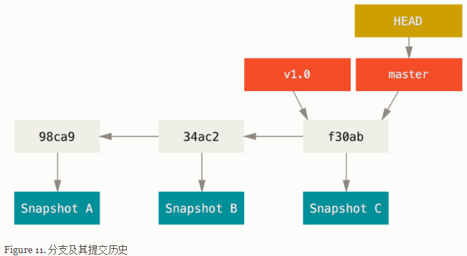

**分支创建**

Git 是怎么创建新分支的呢？ 很简单，它只是为你创建了一个可以移动的新的指针。 比如，创建一个 testing 分支， 你需要使用 `git branch` 命令： 

```shell
$ git branch testing
```

这会在当前所在的提交对象上创建一个指针。 

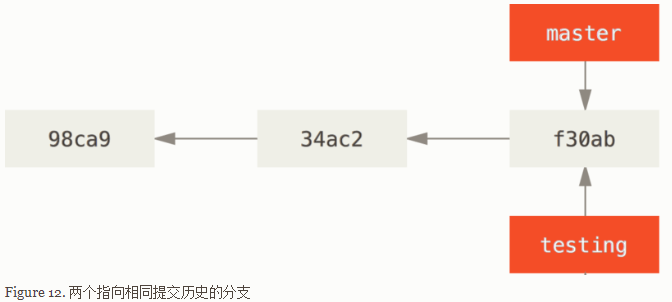

那么，Git 又是怎么知道当前在哪一个分支上呢？ 也很简单，它有一个名为 `HEAD` 的特殊指针。  在本例中，你仍然在 `master` 分支上。 因为 `git branch` 命令仅仅 *创建* 一个新分支，并不会自动切换到新分支中去。 

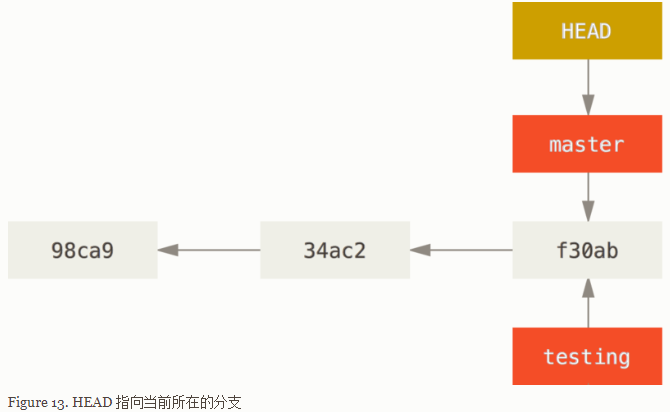你可以简单地使用 `git log` 命令查看各个分支当前所指的对象。 提供这一功能的参数是 `--decorate`。 

```
$ git log --oneline --decorate
f30ab (HEAD, master, testing) add feature #32 - ability to add new
34ac2 fixed bug #1328 - stack overflow under certain conditions
98ca9 initial commit of my project
```

**分支切换**

要切换到一个已存在的分支，你需要使用 `git checkout` 命令。 我们现在切换到新创建的 `testing` 分支去： 

```
$ git checkout testing
```

这样`HEAD`就指向`testing`分支了.

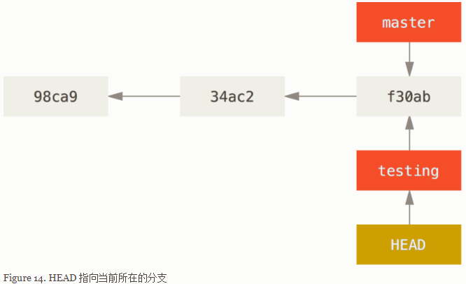

那么，这样的实现方式会给我们带来什么好处呢？ 现在不妨再提交一次： 

```shell
$ vim test.rb
$ git commit -a -m 'made a change'
```

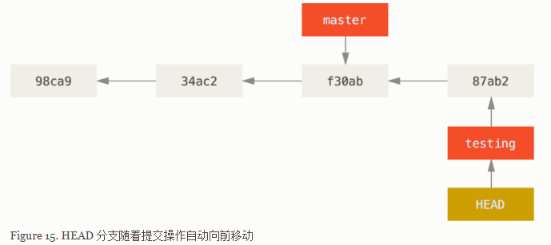如图所示，你的 `testing` 分支向前移动了，但是 `master` 分支却没有，它仍然指向运行 `git checkout` 时所指的对象。 这就有意思了，现在我们切换回 `master` 分支看看：

```shell
$ git checkout master
```

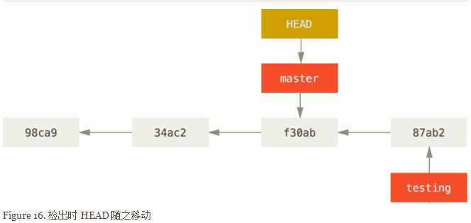

分支切换会改变你工作目录中的文件在切换分支时，一定要注意你工作目录里的文件会被改变。 如果是切换到一个较旧的分支，你的工作目录会恢复到该分支最后一次提交时的样子。 如果 Git 不能干净利落地完成这个任务，它将禁止切换分支。

我们不妨再稍微做些修改并提交：

```
$ vim test.rb
$ git commit -a -m 'made other changes'
```

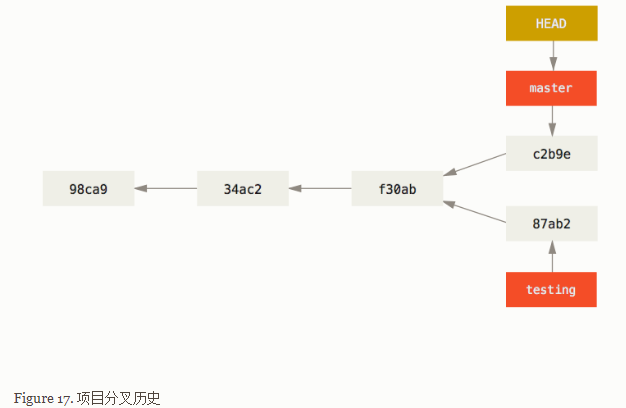

可以简单地使用 `git log` 命令查看分叉历史。 运行 `git log --oneline --decorate --graph --all` ，它会输出你的提交历史、各个分支的指向以及项目的分支分叉情况。 

#### 3.2 Git 分支 - 分支的新建与合并

**分支的新建与合并**

让我们来看一个简单的分支新建与分支合并的例子，实际工作中你可能会用到类似的工作流。 你将经历如下步骤：

1. 开发某个网站。
2. 为实现某个新的需求，创建一个分支。
3. 在这个分支上开展工作。

正在此时，你突然接到一个电话说有个很严重的问题需要紧急修补。 你将按照如下方式来处理：

1. 切换到你的线上分支（production branch）。
2. 为这个紧急任务新建一个分支，并在其中修复它。
3. 在测试通过之后，切换回线上分支，然后合并这个修补分支，最后将改动推送到线上分支。
4. 切换回你最初工作的分支上，继续工作。

**新建分支**

首先，我们假设你正在你的项目上工作，并且已经有一些提交。 

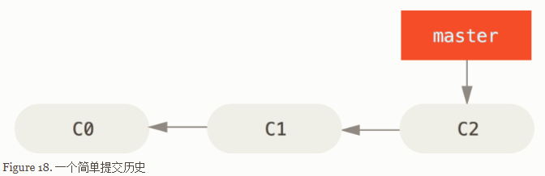

 想要新建一个分支并同时切换到那个分支上，你可以运行一个带有 `-b` 参数的 `git checkout` 命令： 

```shell
$ git checkout -b iss53
Switched to a new branch "iss53"
```

它是下面两条命令的简写:

```shell
$ git branch iss53
$ git checkout iss53
```

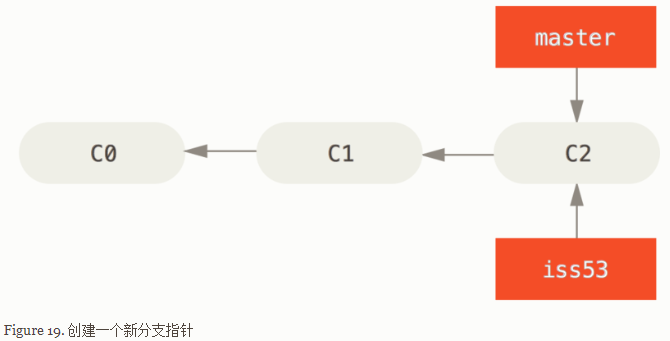

你继续在 #53 问题上工作，并且做了一些提交。 在此过程中，`iss53` 分支在不断的向前推进，因为你已经检出到该分支（也就是说，你的 `HEAD` 指针指向了 `iss53` 分支） 

```shell
$ vim index.html
$ git commit -a -m 'added a new footer [issue 53]'
```

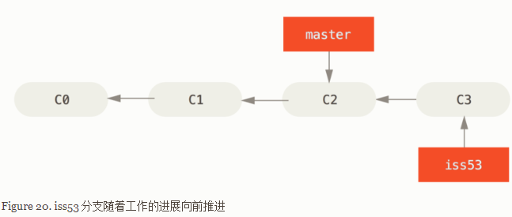

 现在，我们假设你已经把你的修改全部提交了，这时你可以切换回 `master` 分支了： 

```shell
$ git checkout master 
Switched to branch 'master'
```

当你切换分支的时候，Git 会重置你的工作目录，使其看起来像回到了你在那个分支上最后一次提交的样子。 Git 会自动添加、删除、修改文件以确保此时你的工作目录和这个分支最后一次提交时的样子一模一样。 

接下来，你要修复这个紧急问题。 让我们建立一个针对该紧急问题的分支（hotfix branch），在该分支上工作直到问题解决： 

```shell 
$ git checkout -b hotfix
Switched to a new branch 'hotfix'
$ vim index.html
$ git commit -a -m 'fixed the broken email address'
[hotfix 1fb7853] fixed the broken email address
 1 file changed, 2 insertions(+)
```

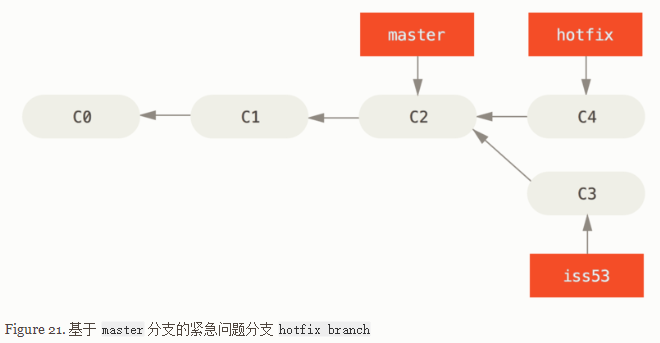

你可以运行你的测试，确保你的修改是正确的，然后将其合并回你的 `master` 分支来部署到线上。 你可以使用 `git merge` 命令来达到上述目的： 

```shell
$ git checkout master
$ git merge hotfix
Updating f42c576..3a0874c
Fast-forward
 index.html | 2 ++
 1 file changed, 2 insertions(+)
```

在合并的时候，你应该注意到了"快进（fast-forward）"这个词。 由于当前 `master` 分支所指向的提交是你当前提交（有关 hotfix 的提交）的直接上游，所以 Git 只是简单的将指针向前移动。 换句话说，当你试图合并两个分支时，如果顺着一个分支走下去能够到达另一个分支，那么 Git 在合并两者的时候，只会简单的将指针向前推进（指针右移），因为这种情况下的合并操作没有需要解决的分歧——这就叫做 “快进（fast-forward）”。 

现在，最新的修改已经在 `master` 分支所指向的提交快照中，你可以着手发布该修复了。 

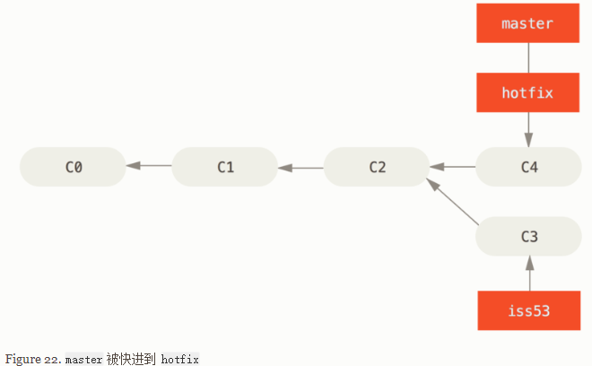

关于这个紧急问题的解决方案发布之后，你准备回到被打断之前时的工作中。 然而，你应该先删除 `hotfix`分支，因为你已经不再需要它了 —— `master` 分支已经指向了同一个位置。 你可以使用带 `-d` 选项的 `git branch` 命令来删除分支： 

```shell
$ git branch -d hotfix
Deleted branch hotfix (3a0874c)
```

现在你可以切换回你正在工作的分支继续你的工作，也就是针对 #53 问题的那个分支（iss53 分支）。 

```shell
$ git checkout iss53
Switched to branch "iss53"
$ vim index.html
$ git commit -a -m 'finished the new footer [issue 53]'
[iss53 ad82d7a] finished the new footer [issue 53]
1 file changed, 1 insertion(+)
```

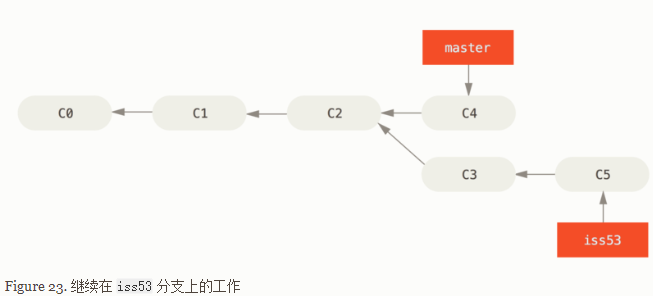

你在 `hotfix` 分支上所做的工作并没有包含到 `iss53` 分支中。 如果你需要拉取 `hotfix` 所做的修改，你可以使用 `git merge master` 命令将 `master` 分支合并入 `iss53` 分支，或者你也可以等到 `iss53` 分支完成其使命，再将其合并回 `master` 分支。 

**分支的合并**

假设你已经修正了 #53 问题，并且打算将你的工作合并入 `master` 分支。 为此，你需要合并 `iss53` 分支到 `master` 分支，这和之前你合并 `hotfix` 分支所做的工作差不多。 你只需要检出到你想合并入的分支，然后运行 `git merge` 命令： 

```shell
$ git checkout master
Switched to branch 'master'
$ git merge iss53
Merge made by the 'recursive' strategy.
index.html |    1 +
1 file changed, 1 insertion(+)
```

这和你之前合并 `hotfix` 分支的时候看起来有一点不一样。 在这种情况下，你的开发历史从一个更早的地方开始分叉开来（diverged）。 因为，`master` 分支所在提交并不是 `iss53` 分支所在提交的直接祖先，Git 不得不做一些额外的工作。 出现这种情况的时候，Git 会使用两个分支的末端所指的快照（`C4` 和 `C5`）以及这两个分支的工作祖先（`C2`），做一个简单的三方合并。 

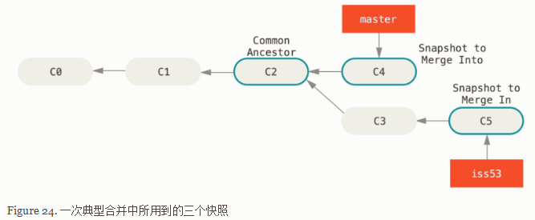

和之前将分支指针向前推进所不同的是，Git 将此次三方合并的结果做了一个新的快照并且自动创建一个新的提交指向它。 这个被称作一次合并提交，它的特别之处在于他有不止一个父提交。 

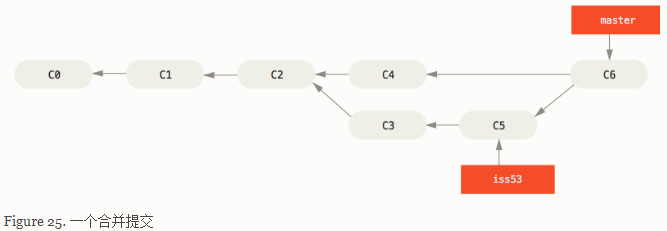

既然你的修改已经合并进来了，你已经不再需要 `iss53` 分支了。 现在你可以在任务追踪系统中关闭此项任务，并删除这个分支。 

```shell
$ git branch -d iss53
```

**遇到冲突时的分支合并**

有时候合并操作不会如此顺利。 如果你在两个不同的分支中，对同一个文件的同一个部分进行了不同的修改，Git 就没法干净的合并它们。 如果你对 #53 问题的修改和有关 `hotfix` 的修改都涉及到同一个文件的同一处，在合并它们的时候就会产生合并冲突： 

```shell
$ git merge iss53
Auto-merging index.html
CONFLICT (content): Merge conflict in index.html
Automatic merge failed; fix conflicts and then commit the result.
```

此时 Git 做了合并，但是没有自动地创建一个新的合并提交。 Git 会暂停下来，等待你去解决合并产生的冲突。 你可以在合并冲突后的任意时刻使用 `git status` 命令来查看那些因包含合并冲突而处于未合并（unmerged）状态的文件： 

```shell
$ git status
On branch master
You have unmerged paths.
  (fix conflicts and run "git commit")

Unmerged paths:
  (use "git add <file>..." to mark resolution)

    both modified:      index.html

no changes added to commit (use "git add" and/or "git commit -a")
```

任何因包含合并冲突而有待解决的文件，都会以未合并状态标识出来。 Git 会在有冲突的文件中加入标准的冲突解决标记，这样你可以打开这些包含冲突的文件然后手动解决冲突。 出现冲突的文件会包含一些特殊区段，看起来像下面这个样子： 

```shell
<<<<<<< HEAD:index.html
<div id="footer">contact : email.support@github.com</div>
=======
<div id="footer">
 please contact us at support@github.com
</div>
>>>>>>> iss53:index.html
```

这表示 `HEAD` 所指示的版本（也就是你的 `master` 分支所在的位置，因为你在运行 merge 命令的时候已经检出到了这个分支）在这个区段的上半部分（`=======` 的上半部分），而 `iss53` 分支所指示的版本在 `=======` 的下半部分。 为了解决冲突，你必须选择使用由 `=======` 分割的两部分中的一个，或者你也可以自行合并这些内容。 例如，你可以通过把这段内容换成下面的样子来解决冲突： 

```shell
<div id="footer">
please contact us at email.support@github.com
</div>
```

上述的冲突解决方案仅保留了其中一个分支的修改，并且 `<<<<<<<` , `=======` , 和 `>>>>>>>` 这些行被完全删除了。 在你解决了所有文件里的冲突之后，对每个文件使用 `git add` 命令来将其标记为冲突已解决。 一旦暂存这些原本有冲突的文件，Git 就会将它们标记为冲突已解决。 

等你退出合并工具之后，Git 会询问刚才的合并是否成功。 如果你回答是，Git 会暂存那些文件以表明冲突已解决： 你可以再次运行 `git status` 来确认所有的合并冲突都已被解决： 

```shell
$ git status
On branch master
All conflicts fixed but you are still merging.
  (use "git commit" to conclude merge)

Changes to be committed:

    modified:   index.html
```

如果你对结果感到满意，并且确定之前有冲突的的文件都已经暂存了，这时你可以输入 `git commit` 来完成合并提交. 默认情况下提交信息看起来像下面这个样子： 

```shell
Merge branch 'iss53'

Conflicts:
    index.html
#
# It looks like you may be committing a merge.
# If this is not correct, please remove the file
#	.git/MERGE_HEAD
# and try again.


# Please enter the commit message for your changes. Lines starting
# with '#' will be ignored, and an empty message aborts the commit.
# On branch master
# All conflicts fixed but you are still merging.
#
# Changes to be committed:
#	modified:   index.html
#
```

#### 3.3 Git分支 - 分支管理

**分支管理**

`git branch`命令不只是可以创建与删除分支. 如果不加任何参数运行它, 会得到当前所有分支的一个列表:

```shell 
$ git branch
  iss53
* master
  testing
```

注意 `master` 分支前的 `*` 字符：它代表现在检出的那一个分支（也就是说，当前 `HEAD` 指针所指向的分支）。 这意味着如果在这时候提交，`master` 分支将会随着新的工作向前移动。 

如果需要查看每一个分支的最后一次提交,可以运行`git branch -v`命令:

```shell
$ git branch -v
  iss53   93b412c fix javascript issue
* master  7a98805 Merge branch 'iss53'
  testing 782fd34 add scott to the author list in the readmes
```

`--merged`与`no-merged`这两个有用的选项可以过滤这个列表中已经合并或尚未合并到当前分支的分支.

如果要查看哪些分支已经合并到当前分支, 可以运行`git branch --merged`:

```shell
$ git branch --merged
	iss53
* master
```

因为之前已经合并了`iss53`分支,所以现在看到它在列表中. 在这个列表中分支名字前没有`*`的分支通常可以使用`git branch -d`删除掉; 你已经将它们整合到了另一个分支,所以并不会失去任何东西.

查看所有包含未合并工作的分支, 可以运行`git branch --no-merged`:

```shell
$ git branch --no-merged
 testing
```

这里显示了其他分支。 因为它包含了还未合并的工作，尝试使用 `git branch -d` 命令删除它时会失败： 

```shell
$ git branch -d testing
error: The branch 'testing' is not fully merged.
If you are sure you want to delete it, run 'git branch -D testing'.
```

如果真的想要删除分支并丢掉那些分支,如同帮助信息里所指出的, 可以使用`-D`选项强制删除它.

#### 3.4 Git 分支 - 分支开发工作流

**分支开发工作流**

现在你已经学会新建和合并分支，那么你可以或者应该用它来做些什么呢？ 在本节，我们会介绍一些常见的利用分支进行开发的工作流程。 

**长期分支**

许多使用 Git 的开发者都喜欢使用这种方式来工作，比如只在 `master` 分支上保留完全稳定的代码——有可能仅仅是已经发布或即将发布的代码。 他们还有一些名为 `develop` 或者 `next` 的平行分支，被用来做后续开发或者测试稳定性——这些分支不必保持绝对稳定，但是一旦达到稳定状态，它们就可以被合并入 `master` 分支了。 

事实上我们刚才讨论的，是随着你的提交而不断右移的指针。 稳定分支的指针总是在提交历史中落后一大截，而前沿分支的指针往往比较靠前。 

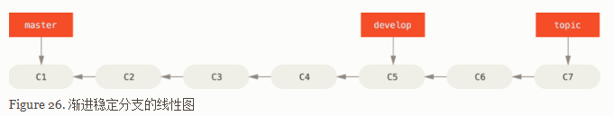

通常把他们想象成流水线（work silos）可能更好理解一点，那些经过测试考验的提交会被遴选到更加稳定的流水线上去。 

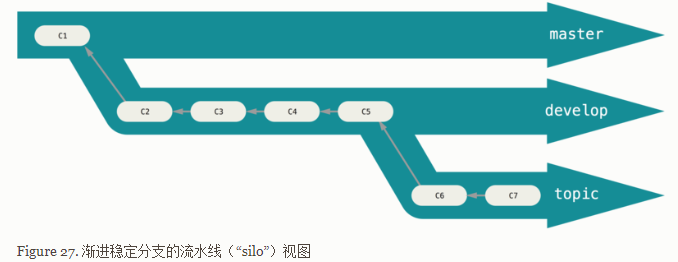

你可以用这种方法维护不同层次的稳定性。 一些大型项目还有一个 `proposed`（建议） 或 `pu: proposed updates`（建议更新）分支，它可能因包含一些不成熟的内容而不能进入 `next` 或者 `master` 分支。 这么做的目的是使你的分支具有不同级别的稳定性；当它们具有一定程度的稳定性后，再把它们合并入具有更高级别稳定性的分支中。 再次强调一下，使用多个长期分支的方法并非必要，但是这么做通常很有帮助，尤其是当你在一个非常庞大或者复杂的项目中工作时。 

**特性分支**

 特性分支是一种短期分支，它被用来实现单一特性或其相关工作。 

考虑这样一个例子，你在 `master` 分支上工作到 `C1`，这时为了解决一个问题而新建 `iss91` 分支，在 `iss91`分支上工作到 `C4`，然而对于那个问题你又有了新的想法，于是你再新建一个 `iss91v2` 分支试图用另一种方法解决那个问题，接着你回到 `master` 分支工作了一会儿，你又冒出了一个不太确定的想法，你便在 `C10`的时候新建一个 `dumbidea` 分支，并在上面做些实验。 你的提交历史看起来像下面这个样子： 

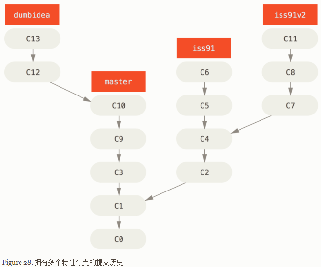

现在，我们假设两件事情：你决定使用第二个方案来解决那个问题，即使用在 `iss91v2` 分支中方案；另外，你将 `dumbidea` 分支拿给你的同事看过之后，结果发现这是个惊人之举。 这时你可以抛弃 `iss91` 分支（即丢弃 `C5` 和 `C6` 提交），然后把另外两个分支合并入主干分支。 最终你的提交历史看起来像下面这个样子： 

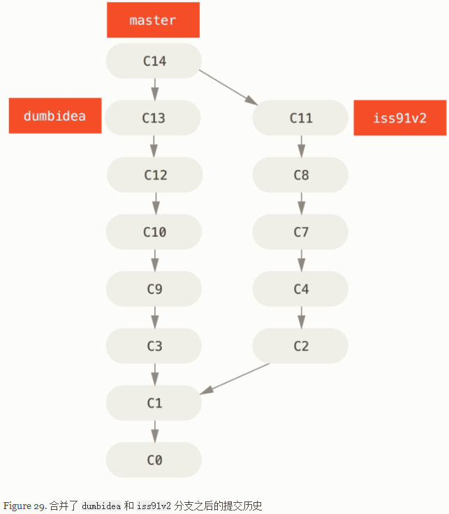

请牢记，当你做这么多操作的时候，这些分支全部都存于本地。 当你新建和合并分支的时候，所有这一切都只发生在你本地的 Git 版本库中 —— 没有与服务器发生交互。 

#### 3.5 Git 分支 - 远程分支

**远程分支**

远程引用是对远程仓库的引用（指针），包括分支、标签等等。 

你可以通过 `git ls-remote (remote)` 来显式地获得远程引用的完整列表，或者通过 `git remote show (remote)` 获得远程分支的更多信息。 然而，一个更常见的做法是利用远程跟踪分支。 

远程跟踪分支是远程分支状态的引用。 它们是你不能移动的本地引用，当你做任何网络通信操作时，它们会自动移动。 远程跟踪分支像是你上次连接到远程仓库时，那些分支所处状态的书签。 

它们以 `(remote)/(branch)` 形式命名。 例如，如果你想要看你最后一次与远程仓库 `origin` 通信时 `master`分支的状态，你可以查看 `origin/master` 分支。 你与同事合作解决一个问题并且他们推送了一个 `iss53` 分支，你可能有自己的本地 `iss53` 分支；但是在服务器上的分支会指向 `origin/iss53` 的提交。 

这可能有一点儿难以理解，让我们来看一个例子。 假设你的网络里有一个在 `git.ourcompany.com` 的 Git 服务器。 如果你从这里克隆，Git 的 `clone` 命令会为你自动将其命名为 `origin`，拉取它的所有数据，创建一个指向它的 `master` 分支的指针，并且在本地将其命名为 `origin/master`。 Git 也会给你一个与 origin 的 `master` 分支在指向同一个地方的本地 `master` 分支，这样你就有工作的基础。 

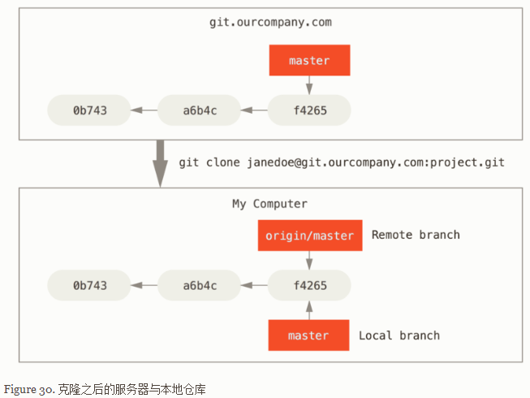

如果你在本地的 `master` 分支做了一些工作，然而在同一时间，其他人推送提交到 `git.ourcompany.com` 并更新了它的 `master` 分支，那么你的提交历史将向不同的方向前进。 也许，只要你不与 origin 服务器连接，你的 `origin/master` 指针就不会移动。 

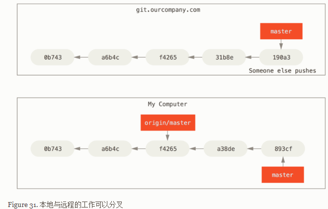

如果要同步你的工作，运行 `git fetch origin` 命令。 这个命令查找 “origin” 是哪一个服务器（在本例中，它是 `git.ourcompany.com`），从中抓取本地没有的数据，并且更新本地数据库，移动 `origin/master`指针指向新的、更新后的位置。 

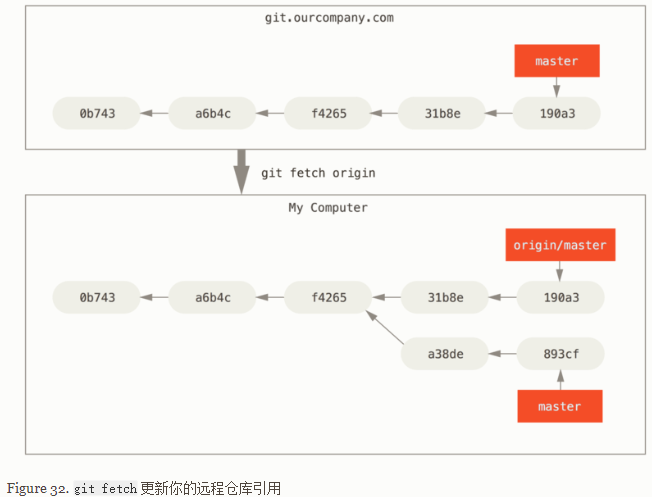

为了演示有多个远程仓库与远程分支的情况，我们假定你有另一个内部 Git 服务器，仅用于你的 sprint 小组的开发工作。 这个服务器位于 `git.team1.ourcompany.com`。 你可以运行 `git remote add` 命令添加一个新的远程仓库引用到当前的项目，这个命令我们会在 Git 基础中详细说明。 将这个远程仓库命名为 `teamone`，将其作为整个 URL 的缩写。 

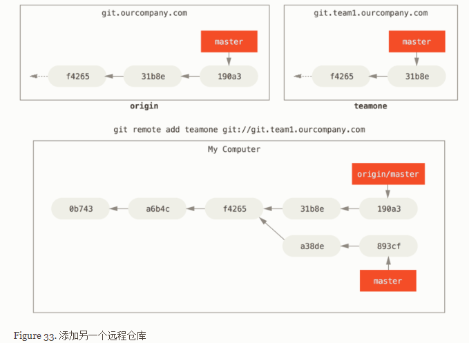

现在，可以运行 `git fetch teamone` 来抓取远程仓库 `teamone` 有而本地没有的数据。 因为那台服务器上现有的数据是 `origin` 服务器上的一个子集，所以 Git 并不会抓取数据而是会设置远程跟踪分支 `teamone/master` 指向 `teamone` 的 `master` 分支。 

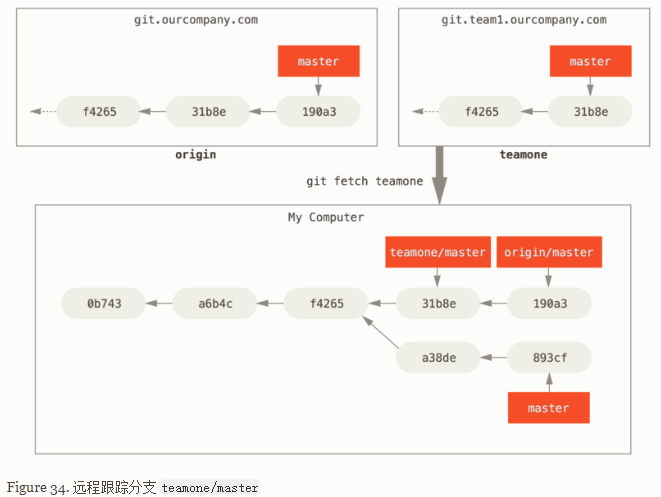

**推送**

当你想要公开分享一个分支时, 需要将其推送到有写入权限的远程仓库上. 本地的分支并不会自动与远程仓库同步 - 你必须显示地推送想要分享的分支.

如果希望和别人一起在名为`serverfix`的分支上工作, 你可以像推送第一个分支那样推送它.运行`git push (remote) (branch):`

```shell
$ git push origin serverfix
Counting objects: 24, done.
Delta compression using up to 8 threads.
Compressing objects: 100% (15/15), done.
Writing objects: 100% (24/24), 1.91 KiB | 0 bytes/s, done.
Total 24 (delta 2), reused 0 (delta 0)
To https://github.com/schacon/simplegit
 * [new branch]      serverfix -> serverfix
```

下一次其他协作者从服务器上抓取数据时，他们会在本地生成一个远程分支 `origin/serverfix`，指向服务器的 `serverfix` 分支的引用： 

```shell
$ git fetch origin
remote: Counting objects: 7, done.
remote: Compressing objects: 100% (2/2), done.
remote: Total 3 (delta 0), reused 3 (delta 0)
Unpacking objects: 100% (3/3), done.
From https://github.com/schacon/simplegit
 * [new branch]      serverfix    -> origin/serverfix
```

可以运行 `git merge origin/serverfix` 将这些工作合并到当前所在的分支。 如果想要在自己的 `serverfix` 分支上工作，可以将其建立在远程跟踪分支之上： 

```shell
$ git checkout -b serverfix origin/serverfix
Branch serverfix set up to track remote branch serverfix from origin.
Switched to a new branch 'serverfix'
```

这会给你一个用于工作的本地分支，并且起点位于 `origin/serverfix`。 

**跟踪分支**

从一个远程跟踪分支检出一个本地分支会自动创建一个叫做 “跟踪分支”（有时候也叫做 “上游分支”）。 跟踪分支是与远程分支有直接关系的本地分支。 如果在一个跟踪分支上输入 `git pull`，Git 能自动地识别去哪个服务器上抓取、合并到哪个分支。 

当克隆一个仓库时，它通常会自动地创建一个跟踪 `origin/master` 的 `master` 分支。 然而，如果你愿意的话可以设置其他的跟踪分支 - 其他远程仓库上的跟踪分支，或者不跟踪 `master` 分支。 最简单的就是之前看到的例子，运行 `git checkout -b [branch] [remotename]/[branch]`。 这是一个十分常用的操作所以 Git 提供了 `--track` 快捷方式： 

```shell
$ git checkout --track origin/serverfix
Branch serverfix set up to track remote branch serverfix from origin.
Switched to a new branch 'serverfix'
```

如果想要将本地分支与远程分支设置为不同名字，你可以轻松地增加一个不同名字的本地分支的上一个命令： 

```shell
$ git checkout -b sf origin/serverfix
Branch sf set up to track remote branch serverfix from origin.
Switched to a new branch 'sf'
```

现在，本地分支 `sf` 会自动从 `origin/serverfix` 拉取 .

设置已有的本地分支跟踪一个刚刚拉取下来的远程分支，或者想要修改正在跟踪的上游分支，你可以在任意时间使用 `-u` 或 `--set-upstream-to` 选项运行 `git branch` 来显式地设置。 

```shell
$ git branch -u origin/serverfix
Branch serverfix set up to track remote branch serverfix from origin.
```

如果想要查看设置的所有跟踪分支，可以使用 `git branch` 的 `-vv` 选项。 这会将所有的本地分支列出来并且包含更多的信息，如每一个分支正在跟踪哪个远程分支与本地分支是否是领先、落后或是都有。 

```shell
$ git branch -vv
  iss53     7e424c3 [origin/iss53: ahead 2] forgot the brackets
  master    1ae2a45 [origin/master] deploying index fix
* serverfix f8674d9 [teamone/server-fix-good: ahead 3, behind 1] this should do it
  testing   5ea463a trying something new
```

这里可以看到 `iss53` 分支正在跟踪 `origin/iss53` 并且 “ahead” 是 2，意味着本地有两个提交还没有推送到服务器上。 也能看到 `master` 分支正在跟踪 `origin/master` 分支并且是最新的。 接下来可以看到 `serverfix` 分支正在跟踪 `teamone` 服务器上的 `server-fix-good` 分支并且领先 3 落后 1，意味着服务器上有一次提交还没有合并入同时本地有三次提交还没有推送。 最后看到 `testing` 分支并没有跟踪任何远程分支。

需要重点注意的一点是这些数字的值来自于你从每个服务器上最后一次抓取的数据。 这个命令并没有连接服务器，它只会告诉你关于本地缓存的服务器数据。 如果想要统计最新的领先与落后数字，需要在运行此命令前抓取所有的远程仓库。 可以像这样做：`$ git fetch --all; git branch -vv`

**拉取**

当 `git fetch` 命令从服务器上抓取本地没有的数据时，它并不会修改工作目录中的内容。 它只会获取数据然后让你自己合并。 然而，有一个命令叫作 `git pull` 在大多数情况下它的含义是一个 `git fetch` 紧接着一个 `git merge` 命令。 如果有一个像之前章节中演示的设置好的跟踪分支，不管它是显式地设置还是通过 `clone` 或 `checkout` 命令为你创建的，`git pull` 都会查找当前分支所跟踪的服务器与分支，从服务器上抓取数据然后尝试合并入那个远程分支。

由于 `git pull` 的魔法经常令人困惑所以通常单独显式地使用 `fetch` 与 `merge` 命令会更好一些。

**删除远程分支**

假设你已经通过远程分支做完所有的工作了 - 也就是说你和你的协作者已经完成了一个特性并且将其合并到了远程仓库的 `master` 分支（或任何其他稳定代码分支）。 可以运行带有 `--delete` 选项的 `git push` 命令来删除一个远程分支。 如果想要从服务器上删除 `serverfix` 分支，运行下面的命令： 

```shell
$ git push origin --delete serverfix
To https://github.com/schacon/simplegit
 - [deleted]         serverfix
```

基本上这个命令做的只是从服务器上移除这个指针。 Git 服务器通常会保留数据一段时间直到垃圾回收运行，所以如果不小心删除掉了，通常是很容易恢复的。 

#### 3.6 Git 分支 - 变基

**变基**

在 Git 中整合来自不同分支的修改主要有两种方法：`merge` 以及 `rebase`。 在本节中我们将学习什么是“变基”，怎样使用“变基”，并将展示该操作的惊艳之处，以及指出在何种情况下你应避免使用它。 

**变基的基本操作**

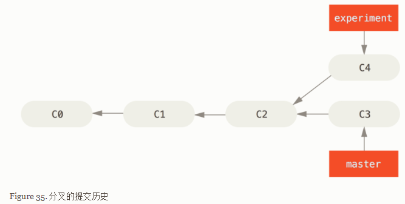

整合分支最容易的方法是 `merge` 命令。 它会把两个分支的最新快照（`C3` 和 `C4`）以及二者最近的共同祖先（`C2`）进行三方合并，合并的结果是生成一个新的快照（并提交）。 

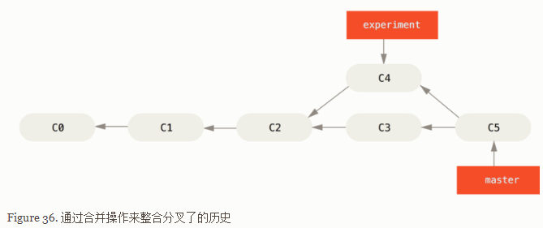

其实，还有一种方法：你可以提取在 `C4` 中引入的补丁和修改，然后在 `C3` 的基础上应用一次。 在 Git 中，这种操作就叫做 *变基*。 你可以使用 `rebase` 命令将提交到某一分支上的所有修改都移至另一分支上，就好像“重新播放”一样。 

在上面这个例子中，运行： 

```shell
$ git checkout experiment
$ git rebase master
First, rewinding head to replay your work on top of it...
Applying: added staged command
```

它的原理是首先找到这两个分支（即当前分支 `experiment`、变基操作的目标基底分支 `master`）的最近共同祖先 `C2`，然后对比当前分支相对于该祖先的历次提交，提取相应的修改并存为临时文件，然后将当前分支指向目标基底 `C3`, 最后以此将之前另存为临时文件的修改依序应用。（译注：写明了 commit id，以便理解，下同） 

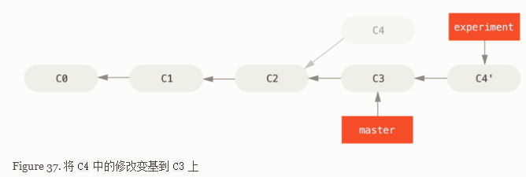

现在回到 `master` 分支，进行一次快进合并。 

```shell
$ git checkout master
$ git merge experiment
```

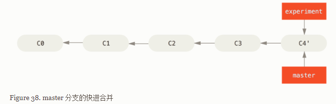

请注意，无论是通过变基，还是通过三方合并，整合的最终结果所指向的快照始终是一样的，只不过提交历史不同罢了。 变基是将一系列提交按照原有次序依次应用到另一分支上，而合并是把最终结果合在一起。 

**更有趣的变基例子**

在对两个分支进行变基时，所生成的“重放”并不一定要在目标分支上应用，你也可以指定另外的一个分支进行应用。 就像 从一个特性分支里再分出一个特性分支的提交历史 中的例子那样。 你创建了一个特性分支 `server`，为服务端添加了一些功能，提交了 `C3` 和 `C4`。 然后从 `C3` 上创建了特性分支 `client`，为客户端添加了一些功能，提交了 `C8` 和 `C9`。 最后，你回到 `server` 分支，又提交了 `C10`。 

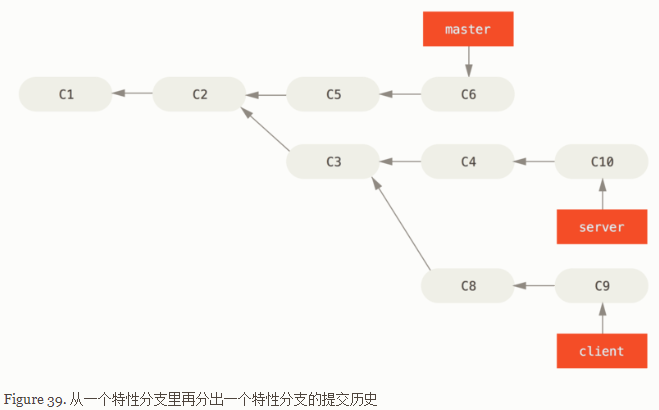

假设你希望将 `client` 中的修改合并到主分支并发布，但暂时并不想合并 `server` 中的修改，因为它们还需要经过更全面的测试。 这时，你就可以使用 `git rebase` 命令的 `--onto` 选项，选中在 `client` 分支里但不在 `server` 分支里的修改（即 `C8` 和 `C9`），将它们在 `master` 分支上重放： 

```shell
$ git rebase --onto master server client
```

以上命令的意思是：“取出 `client` 分支，找出处于 `client` 分支和 `server` 分支的共同祖先之后的修改，然后把它们在 `master` 分支上重放一遍”。 这理解起来有一点复杂，不过效果非常酷。 

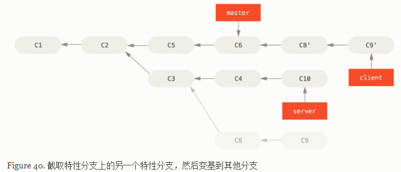

现在可以快进合并 `master` 分支了。（如图 快进合并 master 分支，使之包含来自 client 分支的修改）： 

```shell
$ git checkout master
$ git merge client
```

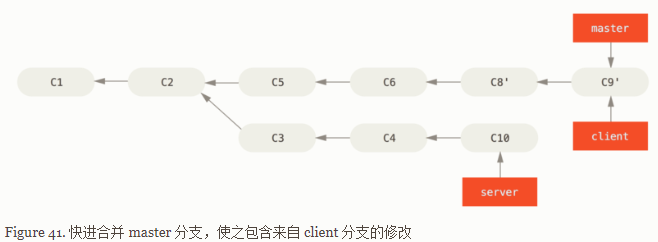

接下来你决定将 `server` 分支中的修改也整合进来。 使用 `git rebase [basebranch] [topicbranch]` 命令可以直接将特性分支（即本例中的 `server`）变基到目标分支（即 `master`）上。这样做能省去你先切换到 `server` 分支，再对其执行变基命令的多个步骤。 

```shell
$ git rebase master server
```

如图 将 server 中的修改变基到 master 上 所示，`server` 中的代码被“续”到了 `master` 后面。 

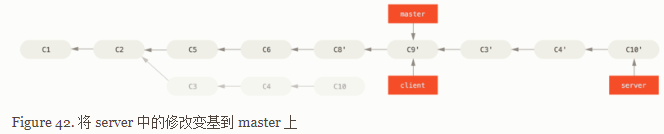

然后就可以快进合并主分支 master 了： 

```shell
$ git checkout master
$ git merge server
```

至此，`client` 和 `server` 分支中的修改都已经整合到主分支里了，你可以删除这两个分支，最终提交历史会变成图 最终的提交历史 中的样子： 

```shell
$ git branch -d client
$ git branch -d server
```

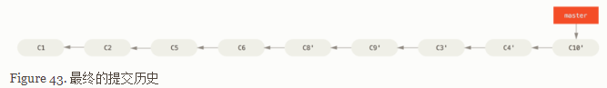

**变基的风险**

**遵守一条准则： **

**不要对在你的仓库外有副本的分支执行变基。** 

变基操作的实质是丢弃一些现有的提交，然后相应地新建一些内容一样但实际上不同的提交。 

让我们来看一个在公开的仓库上执行变基操作所带来的问题。 假设你从一个中央服务器克隆然后在它的基础上进行了一些开发。 你的提交历史如图所示 :

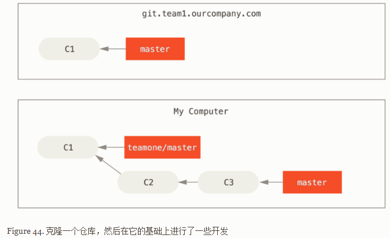

然后，某人又向中央服务器提交了一些修改，其中还包括一次合并。 你抓取了这些在远程分支上的修改，并将其合并到你本地的开发分支，然后你的提交历史就会变成这样： 

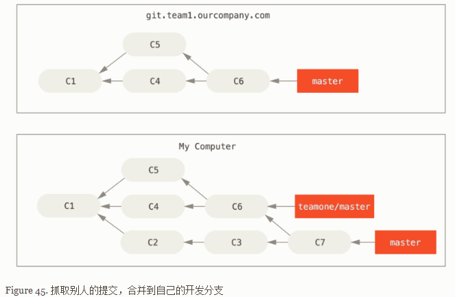

接下来，这个人又决定把合并操作回滚，改用变基；继而又用 `git push --force` 命令覆盖了服务器上的提交历史。 之后你从服务器抓取更新，会发现多出来一些新的提交。 

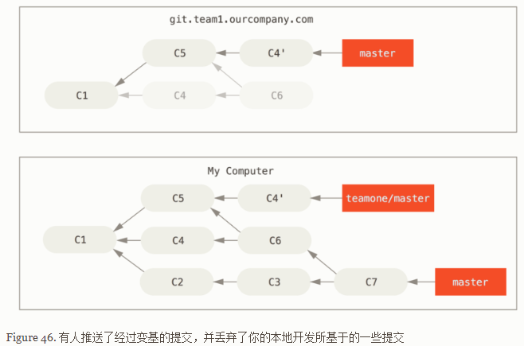

结果就是你们两人的处境都十分尴尬。 如果你执行 `git pull` 命令，你将合并来自两条提交历史的内容，生成一个新的合并提交，最终仓库会如图所示： 

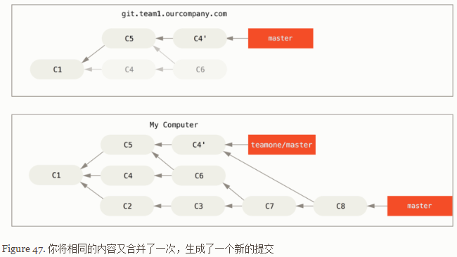

此时如果你执行 `git log` 命令，你会发现有两个提交的作者、日期、日志居然是一样的，这会令人感到混乱。 此外，如果你将这一堆又推送到服务器上，你实际上是将那些已经被变基抛弃的提交又找了回来，这会令人感到更加混乱。 很明显对方并不想在提交历史中看到 `C4` 和 `C6`，因为之前就是他把这两个提交通过变基丢弃的。 

**用变基解决变基**

举个例子，如果遇到前面提到的 有人推送了经过变基的提交，并丢弃了你的本地开发所基于的一些提交 那种情境，如果我们不是执行合并，而是执行 `git rebase teamone/master`, Git 将会： 

- 检查哪些提交是我们的分支上独有的（C2，C3，C4，C6，C7）
- 检查其中哪些提交不是合并操作的结果（C2，C3，C4）
- 检查哪些提交在对方覆盖更新时并没有被纳入目标分支（只有 C2 和 C3，因为 C4 其实就是 C4'）
- 把查到的这些提交应用在 `teamone/master` 上面

从而我们将得到与 你将相同的内容又合并了一次，生成了一个新的提交中不同的结果，如图 在一个被变基然后强制推送的分支上再次执行变基 所示。  

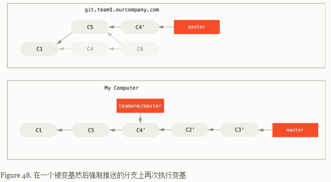

要想上述方案有效，还需要对方在变基时确保 C4' 和 C4 是几乎一样的。 否则变基操作将无法识别，并新建另一个类似 C4 的补丁（而这个补丁很可能无法整洁的整合入历史，因为补丁中的修改已经存在于某个地方了）。

在本例中另一种简单的方法是使用 `git pull --rebase` 命令而不是直接 `git pull`。 又或者你可以自己手动完成这个过程，先 `git fetch`，再 `git rebase teamone/master`。

如果你习惯使用 `git pull` ，同时又希望默认使用选项 `--rebase`，你可以执行这条语句 `git config --global pull.rebase true` 来更改 `pull.rebase` 的默认配置。

只要你把变基命令当作是在推送前清理提交使之整洁的工具，并且只在从未推送至共用仓库的提交上执行变基命令，就不会有事。 假如在那些已经被推送至共用仓库的提交上执行变基命令，并因此丢弃了一些别人的开发所基于的提交，那你就有大麻烦了，你的同事也会因此鄙视你。

**变基vs .合并**

总的原则是，只对尚未推送或分享给别人的本地修改执行变基操作清理历史，从不对已推送至别处的提交执行变基操作，这样，你才能享受到两种方式带来的便利。 