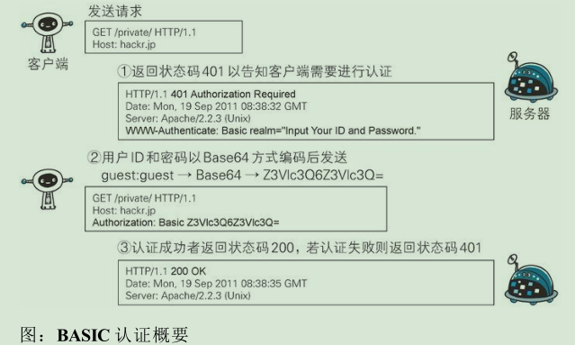

## 第1章 了解Web及网络基础 ##

#### 1.1 使用 HTTP 协议访问 Web  

- **客户端**: 发送**请求**一端.

- **服务器端**: 对请求进行**响应**的一端.

- **Web遵守的协议**: **HTTP**

#### 1.2 HTTP的诞生

**WWW构建技术**

- **HTML**: 作为**页面**的文本标记语言 .

- **HTTP**: 作为文档**传递**协议.

- **URL**: 指定文档所在**地址**.
#### 1.3 网络基础TCP/IP
**TCP/IP的分层管理**
- **应用层**: 应用层决定了向用户提供应用服务时通信的活动.(协议: FTP\DNS\HTTP)
- **传输层**: 提供处于网络连接中的两台计算机之间的数据传输.(协议: TCP/UDP)
- **网络层**: 用来处理在网络上流动的数据包.(协议: IP).

- **数据链路层**: 用来处理连接网络的硬件部分.

**TCP/IP通信传输流**

- 利用 TCP/IP 协议族进行**网络通信**时

  

- 利用 TCP/IP 协议族进行**数据传输**时

  

这种把数据信息包装起来的做法称为**封装**.
#### 1.4 与HTTP关系密切的协议:IP, TCP和DNS

**IP协议**

- **IP**地址: 指明了节点被分配到的地址.
- **MAC**地址: 指网卡所属的固定地址.
- **ARP**协议:根据IP地址反查出对应的MAC地址

**TCP协议**
- 三次握手(TCP的标志(flag): SYN和ACK)

**DNS协议**

- DNS协议的作用: 通过提供域名查找IP地址, 或逆向从IP地址反查域名的服务.

#### 1.5 URI格式

- **完整uri**格式:

---

## 第 2 章 简单的HTTP协议

#### 2.1 HTTP协议用于客户端和服务器端之间的通信

#### 2.2 通过请求和响应的交换达成通信

- **请求报文**

  

  - 请求方法
  - 请求URI
  - 协议版本
  - 可选的请求首部字段
  - 内容实体

- 响应报文

  

  - 协议版本
  - 状态码
  - 用以解释状态码的原因短语
  - 可选的响应首部字段
  - 实体主体

#### 2.3 HTTP是不保存状态的协议

#### 2.4 请求URI定位资源

​	 **HTTP协议使用URI定位互联网上的资源.**

#### 2.5 告知服务器意图的HTTP方法

- **GET:** 获取资源

  GET方法用来请求访问已被URI识别的资源.

- **POST:** 传输实体主体

  POST方法主要目的是传输实体的主体,而不是获取响应的主体内容.

- **PUT:** 传输文件

  PUT方法用来传输文件.

- **HEAD:** 获得报文首部

  HEAD方法和GET方法一样,只是不返回报文主体部分.

- **DELETE:** 删除文件

  DELETE方法用来删除文件,是与PUT相反的方法.

  DELETE方法按请求URI删除指定的资源.

- **OPTIONS:** 询问支持的方法

		OPTIONS方法用来查询针对请求URI指定资源的支持的方法.

- **TRACE:** 追踪路径

  TRACE 方法是让WEB服务器端将之前的请求通信环回给客户端的方法.

- **CONNECT:** 要求用隧道协议连接代理

  CONNECT方法要求在与代理服务器通信时建立隧道,实现用隧道协议进行TCP通信.

#### 2.6 使用方法下达命令

- **HTTP/1.0 和HTTP/1.1 支持的方法**

#### 2.7 持久连接节省通信量

- **持久连接**

  特点: 只要任意一端没有明确提出断开连接,则保持TCP连接状态.

  HTTP/1.1 : 连接默认都是持久连接.

- **管线化**

  特点: 不用等待响应亦可直接发送下一个请求.

#### 2.8 使用Cookie 的状态管理

- 没有Cookie 信息状态下的请求

  

- 第 2 次以后(存有Cookie信息状态)的请求

- 带cookie的报文:

## 第 3 章 HTTP报文内的 HTTP 信息

#### 3.1 HTTP报文

- HTTP报文的结构

  

#### 3.2 请求报文及响应报文的结构

- 请求行

  包含用于请求的方法,请求URI和HTTP版本.

- 状态行

  包含表明响应结果的状态码,原因短语和HTTP版本.

- 首部字段

  包含表示请求和响应的各种条件和属性的各类首部.

  **首部类型:**

  - 通用首部
  - 请求首部
  - 响应首部
  - 实体首部

#### 3.3 编码提升传输速率

- 内容编码:
  - gzip (GNU zip)
  - compress (UNIX 系统的标准压缩)
  - deflate (zlib)
  - identity (不进行编码)

**多部分对象集合包含的对象如下:**

- **multipart/form-data**

  在Web表单文件上传时使用

- **multipart/byteranges**

   状态码206(Partial Content, 部分内容) 响应报文包含了多个范围的内容时使用.

#### 3.6 内容协商返回最合适的内容

**内容协商技术类型**

- 服务器驱动协商

  以请求的首部字段为参考，在服务器端自动处理.

- 客户端驱动协商

  用户从浏览器显示的可选项列表中手动选择.

- 透明协商

  是由服务器端和客户端各自进行内容协商的一种方法.

---

## 第 4 章 返回结果的HTTP状态码

#### 4.1 状态码告知从服务器端返回的请求结果

状态码的类别

#### 4.2 2XX成功

**200 OK:** 表示从客户端发来的请求在服务器端被正常处理了

**204 No Content:** 该状态码代表服务器接收的请求已成功处理,但在返回的响应报文中不含实体的主体部分.

**206 Partial Content:** 该状态码表示客户端进行了范围请求，而服务器成功执行了这部分的GET请求.

#### 4.3 3XX 重定向

**301 Moved Permanently:** 该状态码表示请求的资源已被分配了新的 URI，以后应使用资源现在所指的 URI.

**302 Found:**  该状态码表示请求的资源已被分配了新的 URI，希望用户(本次)能使用新的 URI 访问.

**303 See Other:** 该状态码表示由于请求对应的资源存在着另一个 URI，应使用GET方法定向获取请求的资源。

**304 Not Modified:** 该状态码表示客户端发送附带条件的请求  2 时，服务器端允许请求访问资源，但未满足条件的情况.

**307 Temporary Redirect:** 临时重定向.

#### 4.4 4XX客户端错误

**400 Bad Request:** 该状态码表示请求报文中存在语法错误.

**401 Unauthorized:** 该状态码表示发送的请求需要有通过 HTTP 认证(BASIC 认证,DIGEST 认证)的认证信息.

**403 Forbidden:** 该状态码表明对请求资源的访问被服务器拒绝了.

**404 Not Found:** 该状态码表明服务器上无法找到请求的资源.

#### 4.5 5XX服务器错误

**500 Internal Server Error: ** 该状态码表明服务器端在执行请求时发生了错误.

**503 Service Unavailable:** 该状态码表明服务器暂时处于超负载或正在进行停机维护，现在无法处理请求.

---

## 第 5 章 与 HTTP 协议的 Web 服务器

#### 5.1 用单台虚拟主机实现多个域名

#### 5.2 通信数据转发程序: 代理 网关 隧道

**代理:** 代理服务器的基本行为就是接收客户端发送的请求后转发给其他服务器.

**网关:** 网关能使通信线路上的服务器提供非 HTTP 协议服务.

**隧道:** 隧道可按要求建立起一条与其他服务器的通信线路，届时使用 SSL 等加密手段进行通信。隧道的目的是确保客户端能与服务器进行安全的通信.

#### 5.3 保存资源的缓存

缓存是指代理服务器或客户端本地磁盘内保存的资源副本.

---

## 第 6 章 HTTP首部

#### 6.1 HTTP报文首部

HTTP 协议的请求和响应报文中必定包含 HTTP 首部.

**HTTP请求报文结构**

**HTTP响应报文结构**

####  6.2 HTTP首部字段

**HTTP首部字段结构:**

首部字段名**:** 字段值

**Set-Cookie**

---

## 第 7 章 确保 Web 安全的HTTPS

#### 7.1 HTTP 的缺点

- 通信使用明文(不加密),内容可能会被窃听.
- 不验证通信方的身份,因此有可能遭遇伪装
- 无法证明报文的完整性, 所以有可能已遭篡改

#### 7.2 HTTP + 加密 + 认证 + 完整性保护 = HTTPS

**步骤 1：** 客户端通过发送 Client Hello 报文开始 SSL 通信。报文中包含客户端支持的 SSL 的指定版本、加密组件（Cipher Suite）列表（所使用的加密算法及密钥长度等）。
**步骤 2：** 服务器可进行 SSL 通信时，会以 Server Hello 报文作为应答。和客户端一样，在报文中包含 SSL 版本以及加密组件。服务器的加密组件内容是从接收到的客户端加密组件内筛选出来的。
**步骤 3：** 之后服务器发送 Certificate 报文。报文中包含公开密钥证书。
**步骤 4：** 最后服务器发送 Server Hello Done 报文通知客户端，最初阶段的 SSL 握手协商部分结束。
**步骤 5：** SSL 第一次握手结束之后，客户端以 Client Key Exchange 报文作为回应。报文中包含通信加密中使用的一种被称为 Pre-master secret 的随机密码串。该报文已用步骤 3 中的公开密钥进行加密。
**步骤 6：** 接着客户端继续发送 Change Cipher Spec 报文。该报文会提示服务器，在此报文之后的通信会采用 Pre-master secret 密钥加密。
**步骤 7：** 客户端发送 Finished 报文。该报文包含连接至今全部报文的整体校验值。这次握手协商是否能够成功，要以服务器是否能够正确解密该报文作为判定标准。
**步骤 8：** 服务器同样发送 Change Cipher Spec 报文。
**步骤 9：** 服务器同样发送 Finished 报文。
**步骤 10：** 服务器和客户端的 Finished 报文交换完毕之后，SSL 连接就算建立完成。当然，通信会受到 SSL 的保护。从此处开始进行应用层协议的通信，即发送 HTTP 请求。
**步骤 11：** 应用层协议通信，即发送 HTTP 响应。
**步骤 12：** 最后由客户端断开连接。断开连接时，发送 close_notify 报文。上图做了一些省略，这步之后再发送 TCP FIN 报文来关闭与 TCP的通信。

## 第 8 章 确认访问用户身份的认证

#### 8.1 何为认证
**认证** :确认用户的身份.

**核对的信息**:

 - 密码: 只有本人才会知道的字符串信息.
- 动态令牌: 仅限本人持有的设备内显示的一次性密码.
- 数字证书: 仅限本人(终端)持有的信息.
- 生物认证: 指纹和虹膜等本人的生理信息.
- IC卡: 仅限本人持有的信息.

**HTTP使用的认证方式**(HTTP/1.1)

- BASIC认证(基本认证)
- DIGEST认证(摘要认证)
- SSL客户端认证
- FormBase 认证(基于表单认证)

#### 8.2 BASIC 认证

**BASIC认证的认证步骤**

**BASIC认证缺点:**

- 明文传输

#### 8.3 DIGEST 认证

**DIGEST认证的认证步骤**

**DIGEST认证优缺点:**DIGEST 认证提供防止密码被窃听的保护机制，但并不存在防止用户伪装的保护机制

#### 8.4 SSL客户端认证

**SSL 客户端认证的认证步骤:**

- 步骤 1： 接收到需要认证资源的请求，服务器会发送 Certificate Request 报文，要求客户端提供客户端证书。

- 步骤 2： 用户选择将发送的客户端证书后，客户端会把客户端证书信息以 Client Certificate 报文方式发送给服务器。

- 步骤 3： 服务器验证客户端证书验证通过后方可领取证书内客户端的公开密钥，然后开始 HTTPS 加密通信。

**SSL客户端缺点**: 需要支付一定费用

#### 8.5  基于表单认证

**认证多半为基于表单认证**

**Session管理及Cookie应用**

------

## 第 9 章 基于HTTP的功能追加协议

**SPDY**

---

## 第 10 章 构建 Web 内容的技术

**HTML文本**

**CSS样式**

**JavaScript**

**json数据**

---

## 第 11 章 Web 的攻击技术

####  11.1 针对Web的攻击技术

**对 Web 应用的攻击模式有以下两种**

- 主动攻击
- 被动攻击

- **以服务器为目标的主动攻击**

  **主动攻击（active attack）是指攻击者通过直接访问 Web 应用，把攻击代码传入的攻击模式.**

  - SQL注入攻击

  - OS命令注入攻击

- **以服务器为目标的被动攻击**

  **被动攻击（passive attack）是指利用圈套策略执行攻击代码的攻击模式.**

  - 跨站脚本攻击
  - 跨站点请求伪造

#### 11.2 因输出值转义不完全引发的安全漏洞

**Web应用的安全对策**

- 客户端的验证
- Web应用端(服务器端)的验证
   - 输入值验证
  - 输出值转义

**跨站脚本攻击**

​	跨站脚本攻击（Cross-Site Scripting，XSS）是指通过存在安全漏洞的 Web 网站注册用户的浏览器内运行非法的 HTML 标签或 JavaScript 进行的一种攻击.

**SQL 注入攻击**

​	SQL 注入（SQL Injection）是指针对 Web 应用使用的数据库，通过运行非法的 SQL 而产生的攻击

**OS 命令注入攻击**

​	OS 命令注入攻击（OS Command Injection）是指通过 Web 应用，执行非法的操作系统命令达到攻击的目的。

**HTTP 首部注入攻击**

​	HTTP 首部注入攻击（HTTP Header Injection）是指攻击者通过在响应首部字段内插入换行，添加任意响应首部或主体的一种攻击。

**邮件首部注入攻击**

​	邮件首部注入（Mail Header Injection）是指 Web 应用中的邮件发送功能，攻击者通过向邮件首部 To 或 Subject 内任意添加非法内容发起的攻击。

**目录遍历攻击**

​	目录遍历（Directory Traversal）攻击是指对本无意公开的文件目录，通过非法截断其目录路径后，达成访问目的的一种攻击。

**远程文件包含漏洞**

​	远程文件包含漏洞（Remote File Inclusion）是指当部分脚本内容需要从其他文件读入时，攻击者利用指定外部服务器的 URL 充当依赖文件，让脚本读取之后，就可运行任意脚本的一种攻击。

#### 11.3 因设置或设计上的缺陷引发的安全漏洞

**强制浏览**

​	强制浏览（Forced Browsing）安全漏洞是指，从安置在 Web 服务器的公开目录下的文件中，浏览那些原本非自愿公开的文件.

**不正确的错误消息处理**

​	不正确的错误消息处理（Error Handling Vulnerability）的安全漏洞是指，Web 应用的错误信息内包含对攻击者有用的信息.

**开放重定向**

​	开放重定向（Open Redirect）是一种对指定的任意 URL 作重定向跳转的功能。

#### 11.4 因会话管理疏忽引发的安全漏洞

**会话劫持**

​	会话劫持（Session Hijack）是指攻击者通过某种手段拿到了用户的会话 ID，并非法使用此会话 ID 伪装成用户，达到攻击的目的。

**会话固定攻击案例**

​	会话固定攻击（Session Fixation）攻击会强制用户使用攻击者指定的会话 ID，属于被动攻击。

**跨站点请求伪造**

​	跨站点请求伪造（Cross-Site Request Forgeries，CSRF）攻击是指攻击者通过设置好的陷阱，强制对已完成认证的用户进行非预期的个人信息或设定信息等某些状态更新，属于被动攻击。

#### 11.5 其他安全漏洞

**密码破解**

​	密码破解攻击（Password Cracking）即算出密码，突破认证。

**密码破解手段**

- 通过网络的密码试错
  - 穷举法
  - 字典攻击
- 对已加密密码的破解
  - 通过穷举法
  - 彩虹表
  - 拿到密钥
  - 加密算法的漏洞

**点击劫持**

​	点击劫持（Clickjacking）是指利用透明的按钮或链接做成陷阱，覆盖在 Web 页面之上。

**DoS攻击**

​	DoS 攻击（Denial of Service attack）是一种让运行中的服务呈停止状态的攻击。

**DoS攻击方式**

- 集中利用访问请求造成资源过载,资源用尽的同时,实际上服务也就呈停止状态.
- 通过攻击安全漏洞使服务停止.

**后门程序**

​	后门程序（Backdoor）是指开发设置的隐藏入口，可不按正常步骤使用受限功能.

**后门程序的类型**

- 开发阶段作为Debug 调用的后门程序
- 开发者为了自身利益植入的后门程序
- 攻击者通过某种方法设置的后门程序